# 1.1 - Arquitetura do Sistema Atual - Visão Negócio (versão 1) (Visão Arquitetural - ISO 10746)

## 1.1.1 Business Driver
O sistema em desenvolvimento tem como objetivo aprimorar diversos aspectos da operação do Bank of America, com foco em desempenho, segurança e otimização.

Esses aspectos são cruciais para impulsionar o negócio, principalmente considerando a dinâmica do mercado financeiro, onde o desempenho excepcional é vital para atender às exigências do setor. 

De acordo com dados do relatório anual da McKinsey & Company sobre o setor bancário, é imperativo alcançar o mais alto nível de qualidade com este produto, dada a intensa competição no mercado. Caso contrário, o Bank of America corre o risco de ficar significativamente atrás de seus concorrentes, comprometendo sua posição competitiva.

O projeto tem como meta aperfeiçoar a arquitetura de software do Bank of America, que atualmente utiliza um monolito para consulta de leis gerais. Entretanto, esse sistema enfrenta desafios significativos de lentidão e baixa performance, prejudicando a eficiência das operações.

## 1.1.2 Setor de Aplicação

O sistema atende o setor financeiro, suportando operações críticas de controle de ativos financeiros, controladoria, compliance e governança corporativa. O sistema atende desde pessoas físicas, a companhias e instituições atuando nas áreas de: Consumer Banking, Global Wealth & Investment, Global Banking e Global Markets. Sua área de atuação varia dependendo do país.

Hoje o banco é o 2º maior dos EUA, tendo como critério o total de ativos, possuem 213.000 colaboradores ao redor do mundo, $ 1.9 Trilhões em depósitos e $ 1.1 em empréstimos.

Esse sistema tem como componente o ISS (Investment State System), que é composto por alguns componentes como: Gestão de Conteúdo
de Documentos Eletrônicos Corporativos (ECM), Workflow e Gerenciamento de E-mails. O projeto em questão tem foco no ECM.


## 1.1.3 Adição de Valor

### Identificação dos Benefícios:

- **Operacionais:** O projeto visa aprimorar diversos aspectos operacionais do Bank of America, como eficiência na consulta de leis gerais, agilidade na realização de transações e redução do tempo de resposta para clientes.

- **Financeiros:** Espera-se que a implementação bem-sucedida do sistema resulte em uma redução significativa nos custos operacionais, através da otimização de processos e da minimização de incidentes de segurança que possam acarretar em perdas financeiras.

### Exemplos Concretos:

- **Operacionais:** Com a introdução do novo sistema, espera-se uma redução de 30% no tempo médio de consulta de leis gerais, permitindo que os funcionários acessem informações de maneira mais rápida e eficiente. Isso resultará em uma melhoria perceptível na qualidade do serviço oferecido aos clientes.

- **Financeiros:** Com base no valor da hora das pessoas envolvidas na atuação desse sistema, estimasse que essa nova arquitetura deve gerar um corte de custo de aproximadamente U$ 5 milhões por ano.

### Análise de Impacto:

- A redução de custos operacionais e o aumento da eficiência devem resultar em um impacto financeiro positivo para o Bank of America, refletindo em um ROI significativo para o projeto.
- Os benefícios operacionais serão percebidos pelos funcionários do Bank of America, que poderão realizar suas tarefas de maneira mais eficiente, e pelos clientes, que terão acesso mais rápido e preciso às informações necessárias.

### Resultados Esperados:

Espera-se que o sistema proporcione benefícios operacionais e financeiros tangíveis, melhorando a competitividade do Bank of America no mercado financeiro e garantindo a satisfação contínua dos clientes.

## 1.1.4 Processos de Negócio e Fluxos Críticos 

Nesta seção, são abordados em detalhe o estado atual do sistema em termos de processo de negócio e seus principais fluxos.

## 1.3.1 Listagem de Processos 

A seguir estão listados os principais processos do sistema do Bank of America:

- **Consulta ao ECM**
  - Ao utilizar o serviço do ECM, é possível consultar novas atualizações e validar o estado atual dos documentos.

- **Autenticação e Autorização da Solicitação**
  - Para acessar o sistema, é necessário passar por um processo de autenticação do usuário e obter a autorização necessária para acessar as informações.

- **Escala Conforme Demanda**
  - Dependendo do número de requisições recebidas, as máquinas responsáveis por elas são dimensionadas conforme a necessidade, seguindo orientações do time de desenvolvimento.

## 1.3.2 Diagramas de Fluxo

Abaixo está o diagrama de fluxo mapeado:

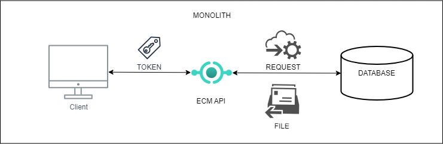

## 1.3.3 Análise de Vulnerabilidades 

Aqui estão as principais vulnerabilidades evidenciadas no sistema:

- **Disponibilidade**
  - Como o sistema é um monolito, uma falha afeta toda a aplicação, prejudicando diretamente a disponibilidade, o que pode representar um grande risco para o Bank of America.

- **Tempo de Resposta**
  - Devido ao alto número de requisições, erros de timeout são comuns, uma vez que não há um sistema de orquestração para gerenciar as requisições enviadas.

## 1.3.4 Sugestões de Aprimoramento

A seguir estão destacadas as sugestões com maior impacto:

- **Orquestrador de Filas**
  - Ao implementar um sistema de gerenciamento de filas, como RabbitMQ, será possível ter um controle mais eficaz da disponibilidade do sistema e antecipar potenciais problemas.

- **Caching de Arquivos Mais Acessados**
  - Utilizando a técnica de caching, será possível reduzir o tempo de resposta da API e melhorar o desempenho geral do sistema.

## 1.1.5 Volumetria

#### Coleta de Dados Quantitativos:

- **Clientes:** O Bank of America possui, atualmente, 66 milhões de clientes em 35 países, cuja a sua maioria se encontra nos Estados Unidos. 

- **Transações:** O Bank of America processa, por dia, cerca de 600 milhões de transações. Com uma variação sazonal durante os períodos de alta que resulta em picos de até 30% desse valor.

- **Falhas:**  Nos últimos seis meses, foram registradas 50 falhas críticas no sistema, com uma média de 2 falhas por semana, afetando diretamente a disponibilidade do serviço para os clientes.

#### Análise de Dados:

- **Identificação de Padrões:** A maioria das falhas ocorrem durante os períodos de pico no sistema, como: quinto dia útil e fins de semana.

- **Correlação com Impactos:** Os momento de pico ocasionam perdas consideráveis à empresa, seja de imagem ou monetário. Por ser uma companhia presente no mundo inteiro, qualquer pequena falha ocasiona uma grande repercursão na mídia e também uma perda de receita considerável, mesmo que seja um valor mínimo por usuário.

#### Identificação de Vulnerabilidades:

- **Pontos de Vulnerabilidade:** o nível de falha advém dos momentos de pico, que devem ser manipulados de forma específica para que tudo ocorra da forma correta.

- **Discussão sobre Vulnerabilidades:** A principal vulnerabilidade se refere justamente aos momentos de pico e também à lentidão dos sistemas em casos de muitas requisições.

#### Propostas de Melhoria:

- **Medidas Corretivas:** A melhoria ideal seria redesenhar a arquitetura do sistema para garantir que os momentos de pico não tragam prejuízo para a empresa. Além disso, fazer testes específicos em ambiente de desenvolvimento para simular momentos de pico e garantir a resiliência do sistema.

### Resultados Esperados:

- Uma seção documentada com tabelas e gráficos que apresentem claramente a volumetria do sistema, destacando as áreas de vulnerabilidade.
- Uma análise criteriosa que conecta os dados quantitativos com as vulnerabilidades do sistema, apoiada por propostas concretas de melhoria.

## 1.1.6. Estratégia de crescimento estabelecida

Estratégia para fornecer uma arquitetura com inteligência baseada em métricas e medidas que permitem um escalonamento de forma a aumentar a disponibilidae e diminuir o tempo de resposta do ECM.

## Riscos e Oportunidades
A identificação dos riscos e oportunidades do projeto é uma importante etapa para identificar a viabilidade do projeto. Dessa forma, conseguimos mapear os possíveis falhas não evitáveis e oportunidades que serão criadas após a implementação do projeto. A seguir, uma matriz que reúne os riscos e oportunidades identificadas e suas descrições:


### Riscos
- **Risco 01 - Não atingir o desempenho e segurança idealizados sem refatorar parte da arquitetura já existe do BOfA**: Existe a possibilidade das soluções propostas para o aumento geral de segurança e desempenho não satisfaçam os critérios de avaliação pois apenas conseguimos trabalhar em cima de suposições e arquiteturas externas ao sistema já construído, tratando-o como uma “caixa preta”;

- **Risco 02: Grande barreira relacionada à novas tecnologias pode impedir a implantação do projeto**: Para aproximar-se ao máximo dos critérios de aceitação de requisitos não funcionais, podemos utilizar de tecnologias e serviços que não condizem com a cultura tecnológica do BOfA. Nesse sentido, outras opções de solucionadores devem ser encontrados;

- **Risco 03: Gerar custos adicionais devido à transição dos componentes sugeridos em AWS para o modelo On-Promise**: Uma das características dos serviços de cloud é a elasticidade de uso de hardware, o que pode não ser uma realidade dependendo do ambiente de implementação do projeto. Dessa forma, custos adicionais podem ser adicionados ao projeto;

- **Risco 04: Não viabilidade da implementação do projeto devido a diferenças entre o ambiente de cloud e On-Promise**: Como estamos simulando ambientes e soluções utilizando a cloud AWS, existe a possibilidade de alguns serviços e tecnologias sejam não adaptáveis para o ambiente real do projeto. Nesse sentido, adaptações de arquitetura e outras soluções devem ser encontradas;

- **Risco 05: Mudanças regulatórias na LGPD ou outras leis que impactem a implementação tecnológica do sistema**: Alterações na legais em leis que impactam tecnologicamente o projeto podem gerar a necessidade de mudanças arquiteturais.

### Oportunidades
- **Oportunidade 01 - Apesar da proposta de nosso grupo seja aumentar segurança e desempenho, a disponibilidade geral do sistema também será beneficiada com as sugestões arquiteturais propostas**: A utilização de recursos como escala horizontal além de beneficiar o desempenho em termos de tempo de resposta, também garantirá a resistência a erros pontuais e disponibilidade do sistema.

- **Oportunidade 02 - Monitoramento aprimorado que serve de base para as medidas de código serem executadas, também servem para insights futuros e auditorias**: Os logs gerados pela aplicação servirão para executar medidas relacionadas a escalabilidade, mas também poderão ser usadas para o entendimento geral do sistema;

- **Oportunidade 03 - Melhor identificação de riscos, que através das métricas recolhidas, podem ser melhor catalogados, avaliados e mitigados**: Com o recolhimento de métricas da aplicação, mais informações de rastreabilidade dos erros que ocorrerem serão geradas e consequentemente, os erros poderão ser melhor tratados;

- **Oportunidade 04 - Possível utilização futura de modelos preditivos para identificação de padrões e falhas**: Com as métricas recolhidas pelo sistema, modelos preditivos poderão ser utilizados para prever ocorrência de eventos, falhas e padrões de acesso;

## Acordo de Nível de Serviço (SLA)

### 1. Partes Envolvidas

#### 1.1 Grupo 3 - Engenharia de Software | Módulo 8
Endereço: Av. Prof. Almeida Prado, 520. Butantã, São Paulo - SP, 05508-070
E-mail: inteli@inteli.edu.br
Telefone: (11) 91097-2525

#### 1.2 Bank of America
Endereço: Faria Lima Financial Center - Av. Brig. Faria Lima, 3400 - Itaim Bibi, São Paulo - SP, 04538-132
Telefone: (11) 2188-4000

### 2. Descrição do Serviço

#### 2.1 O Provedor de Serviço fornecerá ao Cliente os seguintes serviços:

- Proposta de estruturação de Arquitetura externa ao sistema já consolidado (ECM) do Bank of America Brasil;
- Proposta de estruturação de Arquitetura do sistema ECM do Bank of America Brasil caso o provedor julgar viável;
- Criação de serviços que gerem logs das entradas e saídas do sistema;
- Sugestões de técnicas de otimização internas caso o provedor julgar viável;
- Aumento nos níveis de serviço conforme previsto no item 3;

### 3. Acordo de Nível de Serviço (SLA)

O SLA (Service Level Agreement) é um documento para acordar o nível de qualidade e características de um produto ou serviço tecnologico entre um provedor e um cliente. Dessa forma, o grupo formulou um SLA para o projeto, seguindo as características dos requisitos e objetivo do projeto, a fim de estabelecer a qualidade mínima de entrega.

#### 3.1 Disponibilidade
O sistema deverá manter sua disponibilidade atual ou então aumentar sua porcentagem de uptime.

Problemas que podem ocasionar a queda do serviço serão listados com possíveis soluções e suas especificações.

#### 3.2 Tempo de Resposta
As sugestões de alterações de arquitetura devem garantir tempo de resposta igual ou inferior a 10 segundos em todas as funcionalidades, exceto aquelas consideradas de “processamento pesado” pelo provedor.

As funcionalidades consideradas de “processamento pesado” envolvem procedimentos que necessitam de muito recurso computacional como a compilação de diversos arquivos, por exemplo. Ainda sim, sugestões arquiteturais de como diminuir seu tempo de resposta serão feitas, como o uso de processamento em background e o retorno de dados compilados previamente, como uma técnica de cachê.
 
Nas demais funcionalidades, o tempo de resposta não deverá exceder o acordado (10 segundos) em 99,99% das requisições levando em consideração demandas entre 1 e 1000 acessos simultâneos.

#### 3.3 Segurança
O sistema deverá manter seu nível de segurança ou então passar a abordar mais etapas de segurança, sem prejudicar seu uso por parte dos usuários.

As medidas tomadas serão a avaliação de possíveis vulnerabilidades e proposta de proteção contra as mesmas.

#### 3.4: Sobre a entrega do serviço
O serviço será entregue em um arquivo markdown no repositório do projeto preenchido com o estudo de caso do cliente e sugestões arquiteturais e/ou algorítmicas para suas resoluções, acompanhas de diagramas, métricas de simulações, testes realizados e referências.

O estudo será realizado durante o período de 10 semanas, desde o dia 16/04/2024 até 21/06/2024, contabilizando um total de 46 dias com 2 horas de pesquisa em cada.

### 4. Responsabilidades do Cliente
 
#### 4.1 O Cliente deverá fornecer ao Provedor de Serviço as informações e acessos que considerar necessários para a prestação dos serviços.

A falta de alguns dados como diagramas de arquitetura e dados específicos podem influenciar na entrega final do serviço, ainda sim, a pesquisa será realizada e entregue com os dados disponibilizados e o auxílio de simulações e referências.

### 5. Termos e Condições

#### 5.1 Este documento é um estudo sobre como são criados e formalizados contratos de prestação de serviços técnicos, portanto não há validade legal.

#### 5.2 Qualquer alteração ou emenda a este acordo requer a concordância por escrito de ambas as partes.

### Assinaturas:

[Assinatura do Representante do Provedor de Serviço] [Assinatura do Representante do Cliente]

Data: [Data de Assinatura]

# 1.2 - Arquitetura do Sistema Novo - Especificação de Requisitos (Versão 1)

## 1.2.1 Requisitos Não Funcionais Com Vulnerabilidades Identificados no Sistema Atual

### RNF1 - Desempenho:

**Vulnerabilidade:** Limitações nos tempos de resposta durante picos de carga.

**Descrição:** O sistema deve garantir um tempo médio de resposta de 7 segundos para operações de leitura, com um tempo mínimo de 3 segundos e um máximo de 10 segundos. Este padrão de desempenho deve ser mantido independentemente do tipo de serviço acessado, assegurando consistência e previsibilidade na experiência do usuário.

**Teste:** A avaliação do desempenho será realizada por meio de simulações de carga que incrementam o volume de requisições em 50% acima do volume máximo observado, baseado em uma volumetria de "x" requisições por minuto. Estas simulações ajudarão a verificar a capacidade do sistema de manter os tempos de resposta estabelecidos sob condições de carga elevada.

**Resultado Esperado:** O sistema deve cumprir com os critérios de tempo de resposta em 99,999% dos casos testados. Este alto nível de confiabilidade é crucial para assegurar que o sistema possa lidar com picos de demanda sem comprometer a experiência do usuário.

**Justificativa:** Em uma plataforma interna como a do BofA, onde os funcionários realizam uma variedade de tarefas críticas para as operações financeiras, é essencial garantir uma resposta rápida do sistema. Um tempo de resposta das requisições dentro do limite máximo de 10 segundos promove eficiência ao permitir que os usuários concluam suas tarefas de maneira rápida e eficaz. Isso resulta em uma melhor produtividade e experiência do usuário, contribuindo para a otimização dos processos internos e a eficácia das operações financeiras da organização.


### RNF2 - Escalabilidade:

**Vulnerabilidade:** Dificuldades em lidar com crescimento exponencial de dados e usuários.

**Descrição:** A escalabilidade do sistema será assegurada através do uso de técnicas de escalonamento horizontal, que permitem adicionar mais recursos computacionais (como servidores) conforme necessário para lidar com aumentos na carga de trabalho. A decisão de escalar o sistema será baseada em dois parâmetros críticos: tempo de resposta e uso de memória das máquinas.

**Teste:** Serão realizados testes de escalabilidade que gradualmente aumentam a carga no sistema até que o tempo de resposta ou o uso de memória atinjam seus limites pré-definidos. Esses testes ajudarão a determinar a eficácia do escalonamento horizontal em manter a performance adequada sob diferentes níveis de demanda.

**Resultado Esperado:** O sistema deve demonstrar a capacidade de manter tempos de resposta adequados e uso eficiente de memória durante os testes de escalabilidade, validando sua habilidade de ajustar-se a variações na demanda sem degradação de performance. Espera-se que o sistema possa acomodar crescimento significativo do volume de dados e de usuários, mantendo a estabilidade e a eficiência operacional.

**Justificativa:** A plataforma digital do BofA lida com um grande volume de transações e acessos simultâneos, sujeitos a variações na demanda ao longo do tempo. A capacidade de escalar horizontalmente de forma automática, com base na saturação dos recursos da máquina atual, garante que o sistema possa lidar eficientemente com picos de carga sem comprometer o desempenho e a disponibilidade dos serviços, mantendo a qualidade e a capacidade de resposta mesmo em situações de pressão de alta demanda.

### RNF3 - Rastreabilidade de Atividades de Usuários com Capacidade de Identificação via IP/Navegador (Segurança)

**Vulnerabilidade:** Dificuldade de entendimento dos comportamentos dos diversos serviços

**Descrição:**  Este requisito não funcional demanda que o sistema registre as atividades dos usuários por meio de logs, permitindo identificação precisa de informações como endereço IP, navegador, data e hora do acesso, rota do backend acessada e status da requisição retornado. Isso é essencial para garantir transparência, responsabilidade e confiabilidade do software, especialmente em setores críticos como finanças.

**Justificativa:** Em um ambiente financeiro altamente regulado como o do BofA, a segurança da plataforma interna é de extrema importância para proteger os dados sensíveis e prevenir possíveis ataques cibernéticos. Esses registros possibilitam uma auditoria detalhada das ações realizadas na plataforma, permitindo a identificação de atividades suspeitas e a tomada de medidas proativas para mitigar riscos de segurança. Além disso, ao manter um controle rigoroso sobre quem está acessando a plataforma e quais ações estão sendo realizadas, a organização pode garantir a conformidade com regulamentações de segurança e políticas internas, garantindo a integridade e confiabilidade das operações financeiras da empresa.

**Critérios de aceitação:**

- O sistema deve ser capaz de registrar as atividades dos usuários em logs de forma automática e contínua.

- Cada entrada nos logs deve incluir informações detalhadas, como data e hora da atividade, endereço IP do usuário, navegador utilizado, rota acessada pelo usuário e o código HTTP retornado da requisição.

- Os registros de atividades devem ser armazenados de forma segura e acessível apenas por usuários autorizados.

**Casos de teste associados:** *[TESTES NÃO DEFINIDOS E REALIZADOS ATÉ O MOMENTO]*

### RNF4 - Integridade dos Dados nas Requisições Simuladas (Segurança)

**Vulnerabilidade:** Pendência de criptografia em arquivos, permitindo o acesso de pessoas não autorizada.

**Descrição:** Este requisito não funcional estabelece que o sistema deve garantir a integridade dos dados enviados nas requisições simuladas, assegurando que os dados sejam protegidos contra adulterações ou corrupções durante a transmissão.

**Justificativa:** A integridade dos dados é fundamental para garantir a confiabilidade e a segurança dos documentos anexados. No contexto do BofA, onde são manipuladas informações sensíveis relacionadas a transações financeiras e compliance, é essencial proteger os dados contra adulterações durante a transmissão, assegurando que apenas informações autênticas e íntegras sejam processadas. Garantir a integridade dos dados nas requisições simuladas ajudará a proteger contra possíveis ameaças cibernéticas, garantindo que os documentos permaneçam intactos e íntegros durante a transmissão e manipulação. Isso fortalecerá a confiança dos usuários na plataforma e reduzirá o risco de violações de segurança.

**Critérios de Aceitação:**

- O sistema deve ser capaz de detectar e rejeitar qualquer requisição simulada que apresente sinais de manipulação ou adulteração dos dados.

- Todas as transmissões de dados nas requisições simuladas devem ser protegidas por protocolos de segurança adequados, como HTTPS, para prevenir ataques de interceptação ou modificação.

- Deve ser mantido um registro detalhado de todas as transações de dados enviadas e recebidas durante as simulações, incluindo informações sobre a integridade dos dados.

**Casos de teste associados:** *[TESTES NÃO DEFINIDOS E REALIZADOS ATÉ O MOMENTO]*

## Melhorias Esperadas com o Projeto

A pesquisa realizada através desse projeto planeja trazer melhoria em diversos âmbitos dos requisitos não funcionais que suportam as funcionalidades do sistema interno do Bank of America. Dessa forma, vulnerabilidades de segurança identificadas serão catalogadas e soluções serão propostas, assim como recursos arquiteturais para o aumento de performance e disponibilidade. Durante o processo para encontrar tais melhorias, componentes de metrificação, simulação e testes serão criados e podem ser implementados, implicando em uma melhoria da rastreabilidade geral do sistema, facilitando futuras melhorias, insights e disponibilizando controle da operação para os gestores. 

## Avaliação dos mecanismos utilizados no sistema atual

De acordo com o contato que o grupo teve com o parceiro na primeira sprint review, dúvidas foram esclarecidas sobre a arquitetura e componentes atuais do sistema relacionados aos requisitos não funcionais desse projeto. Ainda sim, vale ressaltar que até o momento o grupo não obteve acesso a diagramas arquiteturais de sistema, métricas de volumetria e listagem de serviços do sistema. Dessa forma, a seguir está a avaliação dos mecanismos utilizados atualmente:


Mapa de requisitos não funcionais e respectivas vulnerabilidades

O estudo presente na imagem acima destaca, respectivamente:
- Requisitos não funcionais;
- Vulnerabilidades;
- Dados e transações de entrada;
- Saída esperada para controle de vulnerabilidade;
- Controle utilizado atualmente;
- Monitoramento atual de vulnerabilidade;
- Resolução sistêmica atual de vulnerabilidade;
- Recuperação sistêmica atual de vulnerabilidade.

**Observações:**

### **RNF 01** - Desempenho. 

Vulnerabilidade: Tempo de resposta acima do aceitável (10 segundos) durante picos de carga (mais de 1000 requisições).

---

**Controle:**

O parceiro possui visibilidade de desempenho do sistema, porém seu controle é totalmente manual e pode ser pouco efetivo, visto que a arquitetura não possui abordagem de escalabilidade para auxiliar o desempenho, então a única forma de melhorá-lo é através de correções de código.

**Monitoramento:**

Dados de volumetria são salvos automaticamente através de logs gerados pelos usuários e analisados a partir de dashboards em serviços com Dynatrace.

**Resolução:**

O parceiro mencionou a adoção de filas e processamento assíncrono como medidas para fortalecer o sistema. No entanto, não foram relatadas soluções específicas para lidar com volumes de dados que excedam 1,5 vezes a capacidade do sistema, visando reduzir o tempo médio de processamento. 

**Recuperação:**

O parceiro não expressou usar técnicas de aumento de desempenho fora correções de código.

### **RNF 02** - Escalabilidade. 

Vulnerabilidade: O sistema apresenta dificuldades em lidar com o crescimento exponencial de dados e usuários, atingindo um ponto crítico quando confrontado com 1000 ou mais requisições simultâneas.

---

**Controle:**

O parceiro não implementou recursos de controle de escalabilidade no código, o que gera uma vulnerabilidade significativa. Isso significa que o sistema não está preparado para lidar com aumentos repentinos na demanda, como picos de acesso que podem resultar em mais de 1000 requisições simultâneas. Essa falta de escalabilidade pode levar o sistema a atingir seu limite máximo de capacidade durante tais períodos críticos, comprometendo o desempenho e potencialmente resultando em falhas operacionais.

**Monitoramento:**

O parceiro não expressou o uso de técnicas de escalabilidade, então não há como monitorar a escalabilidade, pois ela não é feita.


**Resolução:**

O parceiro possui uma arquitetura redundante de dois ambientes, sendo um ambiente de produção que realiza os processamentos e outro ambiente redundante para substituí-lo em caso de problemas, mas essa arquitetura não soluciona casos onde a volumetria é maior do que a suportada pelos ambientes, já que não balanceia a carga. Em uma situação de alta volumetria durante um período maior de tempo, os dois ambientes serão derrubados.

**Recuperação:**

Em caso de queda de serviço, o parceiro reestabelecerá o ambiente manualmente e caso a volumetria continuar alta, o ambiente voltará a cair.

### **RNF 03** - Rastreabilidade de Atividades de Usuários com Capacidade de Identificação via IP/Navegador (Segurança)

Vulnerabilidade: Dificuldade de entendimento dos comportamentos dos diversos serviços

---

**Controle:**

O parceiro possui visibilidade de usuários, acessos e informações necessárias relacionadas a segurança, porém seu controle é manual. Dessa forma, ao ultrapassar barreiras de segurança como autenticação e rede, o sistema pode tornar-se frágil arquiteturalmente a outros ataques.

**Monitoramento:**

Logs são gerados e analisados a partir de dashboards em serviços com Dynatrace em todos os serviços com diversas informações, incluindo sobre quem acessa o sistema.

**Resolução:**

Não foram expressas pelo parceiro estratégias de resolução de incidentes de segurança a partir da análise de comportamento dos usuários. Ainda que existam camadas de proteção como autenticação e rede através de VPN, ao conseguir burlá-las, o ambiente estará inseguro.

**Recuperação:**

Realização de bloqueios manualmente por endereço de IP, usuário e/ou região são práticas comuns em ambientes como o do parceiro. Ainda sim, recuperações automáticas não foram expressas.

### **RNF 04** - Integridade dos Dados nas Requisições Simuladas (Segurança)

Vulnerabilidade: Pendência de criptografia em arquivos, permitindo o acesso de pessoas não autorizada

---

**Controle:**

O parceiro possui através de logs, registros de alterações e datas de modificação. Ainda sim, arquiteturalmente, não há maneira de controlar a integradade de arquivos visto que o registro pode ser burlado, ofuscado ou não apresentar detalhes suficientemente comprováveis.

**Monitoramento:**

Logs são gerados e analisados a partir de dashboards em serviços com Dynatrace em todos os serviços com diversas informações, incluindo sobre modificações no sistema.

**Resolução:**

Apesar de existirem logs em diversas ações do sistema, não são usadas estratégias de criptografia e hash nas informações salvas, então técnicas de verificação de integridade, além de data de modificação não devem ser realizadas.

**Recuperação:**

O parceiro não expressou versionamento dos dados salvos e recuperação de integridade.

# 1.3 - Arquitetura do Sistema Novo (Versão 1.5) - Visão Modelo Comportamental (Simulação)


# 2.2 (A) - Controle de Requisitos Não Funcionais

## Mapa de Requisitos Não Funcionais Selecionados

Nesta seção, são apresentados os requisitos não funcionais selecionados para o projeto, com especificações mensuráveis e a eliminação das vulnerabilidades associadas.

### RNF1 - Desempenho

#### Especificação Mensurável:

- Tempo médio de resposta: 7 segundos para operações de leitura.
  - Tempo mínimo: 3 segundos
  - Tempo máximo: 10 segundos

#### Vulnerabilidade Eliminada:

- Limitações nos tempos de resposta durante picos de carga.

### RNF2 - Escalabilidade

#### Especificação Mensurável:

- Capacidade de escalar horizontalmente para lidar com aumento exponencial de dados e usuários.

#### Vulnerabilidade Eliminada:

- Dificuldades em lidar com crescimento exponencial de dados e usuários.

### RNF3 - Rastreabilidade de Atividades de Usuários

#### Especificação Mensurável:

- Registros de atividades dos usuários, incluindo IP, navegador, data/hora de acesso e rota do backend.

#### Vulnerabilidade Eliminada:

- Dificuldade de entender comportamentos dos diversos serviços.

### RNF4 - Integridade dos Dados nas Requisições Simuladas

#### Especificação Mensurável:

- Garantir integridade dos dados nas requisições simuladas, protegendo contra adulterações.

#### Vulnerabilidade Eliminada:

- Pendência de criptografia em arquivos, permitindo acesso não autorizado.

## Pontuação de Controle de Requisitos Não Funcionais


# 2.2 (B) Táticas Arquiteturais para Controle de Requisitos Não Funcionais (RNF) e Eliminação de Vulnerabilidades


## Descrição das Táticas Arquiteturais

Nesta seção, são descritas as táticas arquiteturais adotadas para execução e controle dos Requisitos Não Funcionais (RNFs) do sistema novo, com foco na eliminação das vulnerabilidades e no tratamento dos impactos em caso de falhas nos serviços.

### Tática Arquitetural para Monitoramento de RNF

- **Componente Utilizado:** Ferramenta de Monitoramento de Infraestrutura (por exemplo, Prometheus)
- **Detalhamento:** O sistema implementa uma ferramenta de monitoramento contínuo da infraestrutura, incluindo tempos de resposta, uso de recursos e indicadores de desempenho. Isso permite identificar proativamente qualquer desvio nos RNFs estabelecidos e tomar medidas preventivas antes que ocorram violações.

### Tática Arquitetural para Resolução de RNF (Preventivo e Reativo)

- **Componente Utilizado:** Sistema de Alertas e Ações Automatizadas (por exemplo, Grafana com integração com sistemas de alerta)
- **Detalhamento:** Em caso de desvio nos RNFs identificados, o sistema aciona alertas automáticos para equipes responsáveis. Medidas preventivas são tomadas por meio de ajustes dinâmicos na infraestrutura (escalonamento horizontal, cache inteligente, etc.) para manter os níveis de serviço adequados. Em situações reativas, o sistema realiza ações automáticas de recuperação, como redirecionamento de tráfego ou reinicialização de instâncias.

### Tática Arquitetural para Recuperação ou Subsídio do Tratamento dos Impactos de Quebra de Serviços

- **Componente Utilizado:** Sistema de Orquestração e Balanceamento de Carga (por exemplo, Kubernetes)
- **Detalhamento:** Em caso de quebra de serviços que impactam os RNFs, o sistema utiliza estratégias de orquestração para substituir instâncias com falhas automaticamente, redistribuindo a carga de trabalho entre as instâncias restantes. Isso garante a continuidade do serviço e minimiza os impactos para os usuários finais.

## Pontuação de Controle de Requisitos Não Funcionais

- Descrição das táticas arquiteturais que ajudam a execução e o controle do RNF: 6,0 pontos


# 2.3 (A) Simulação do Sistema Atual com Foco em Requisitos Não Funcionais (RNFs)

## Modelo de Simulação do Sistema Atual

Nesta seção, apresentamos o modelo de simulação do sistema atual com foco nos Requisitos Não Funcionais (RNFs) selecionados, incluindo cenários de simulação e resultados obtidos.

### Cenários de Simulação e Resultados

1. **Simulação do RNF com Vulnerabilidades**
   - **Descrição do Cenário:** Simulação de um cenário onde o RNF de segurança é comprometido por uma vulnerabilidade conhecida.
   - **Metodologia:** Utilização de ferramentas de teste de penetração para identificar e explorar a vulnerabilidade.
   - **Resultados:** Demonstração da exploração bem-sucedida da vulnerabilidade, com possível comprometimento da integridade dos dados.

2. **Simulação de 2 RNFs com Vulnerabilidades**
   - **Descrição do Cenário:** Simulação de cenários adicionais com foco em mais de um RNF comprometido.
   - **Metodologia:** Expansão da simulação para incluir múltiplas vulnerabilidades em diferentes áreas de RNFs.
   - **Resultados:** Identificação e documentação das falhas associadas aos RNFs comprometidos, destacando impactos cumulativos.

### Avaliação dos Resultados

Após a simulação dos cenários, os resultados foram avaliados com base nos critérios estabelecidos para os RNFs selecionados.

- **Análise Qualitativa:** Identificação de lacunas de segurança e desempenho decorrentes das vulnerabilidades simuladas.
- **Recomendações:** Proposição de ações corretivas para mitigar os riscos identificados e melhorar os RNFs afetados.

<br>

# 3. Modelo de Simulação do Atual
Objetivo: Simular o comportamento atual do sistema para identificar pontos críticos e suas causas.

## 3.1 Modelo de Simulação
Definição do Modelo de Simulação:
Por meio de dados mocados e parâmetros definidos como fundamentais para a análise e definição de padrões, simulamos, por meio de gráficos, como o sistema do BofA atualmente se comporta em questão a tempos de resposta pelo número de requisições e como pretendemos melhora-lo.

Seleção de Ferramentas:
A escolha da ferramenta para a simulação deve considerar a capacidade de modelar um ambiente distribuído complexo como o da plataforma ECM do BofA, que possui diversos requisitos não funcionais como volumetria, disponibilidade, segurança, rastreabilidade e tolerância a falhas. Ferramentas como JSL/Simulink podem ser utilizados, visto que permitem modelar sistemas complexos e oferecem recursos para a simulação de eventos discretos que são essenciais para representar o tráfego e as operações do sistema. No modelo inicial de simulação, mocamos dados e plotamos gráficos em Excel para que pudessemos visualizar informações e compara-las, respectivamente.

Parâmetros do Modelo:
Os parâmetros chave para simular incluem:
- Horário
- Solicitações por minuto
- Tipo de arquivo
- Tamanho médio dos arquivos em MB
- Tempo de resposta esperado em segundos
- Uso de CPU

Execução da Simulação:
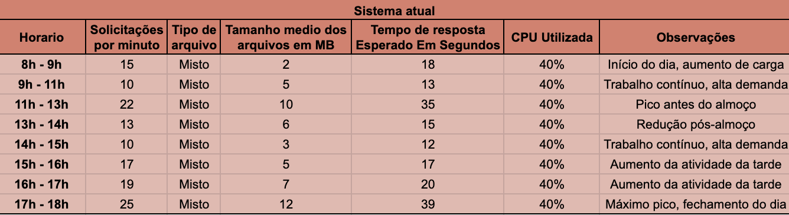
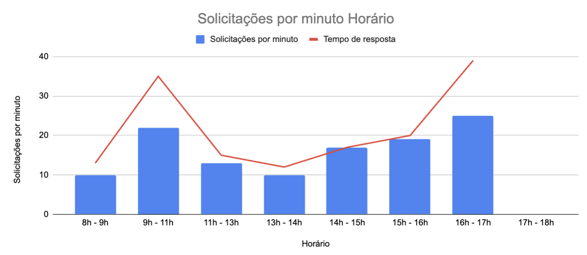

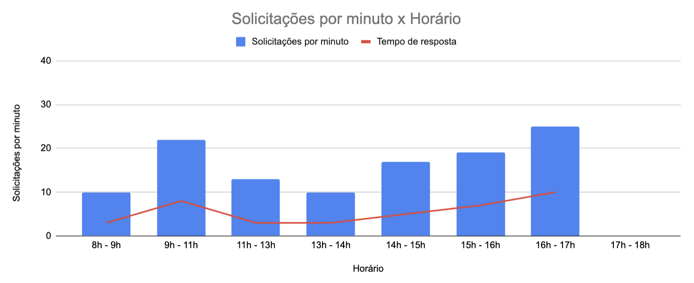

Relatório de Simulação:
Pode-se observar que, no sistema atual do BofA, os tempos de resposta aumentam de forma significativa quanto mais requisições são feitas ao sistema. Nossa proposta é baixar o tempo médio de reposta almejando chegar no limite de 10 segundos para um número considerado alto de requisições. 
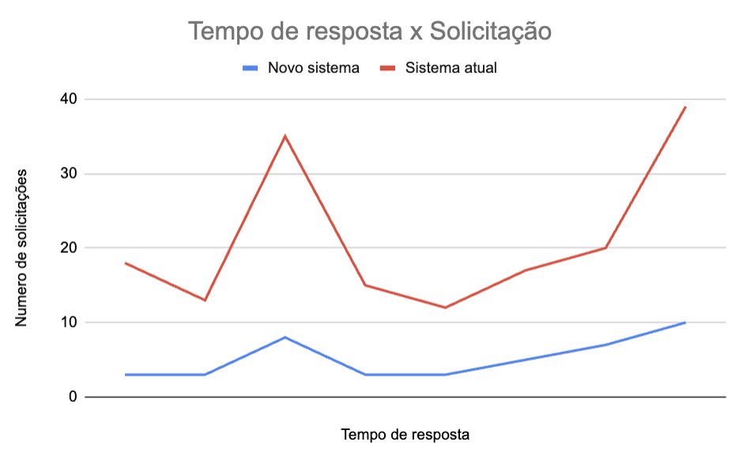

Resultados Esperados:
Com base na simulação, estima-se que os tempos de resposta devam baixar consideralvelmente, limitando-se a não mais que 10 segundos para um grande número de requisições ao sistema. 

Análise dos Resultados:
Com base na simulação, pode-se observar que, em períodos de pico nos horários de trabalho no BofA, o número de requisições se tornava mais alto, consequentemente prejudicando e interferindo na perfomance do sistema. Períodos de horário como das 9h-11h e 16h-17h demonstraram maior relevância na análise destes dados, respectivamente.

Propostas de Melhoria:
Como proposta de melhoria, buscamos implementar uma API que irá monitorar o número de requisições por minutos e suas características baseadas nos parâmetros pré-definidos, para que, por meio de logs de informações, possamos atuar como oobjetivo de reduzir os tempos de resposta e aumentar o desempenho do sistema e otimiza-lo, beneficiando os funcionários que o utilizam. Buscaremos também entender como outros parâmetros como os tamanhos e tipos de arquivos possam interferir nos tempos de resposta de forma mais aprofundada e analítica, ajudando nestes processos.

## 1.3.1 Estrutura estática do modelo

### Objetivo da Simulação
Esta seção descreve a estrutura estática do modelo de simulação utilizado para avaliar e otimizar os Requisitos Não Funcionais (RNFs) selecionados, focando em segurança, performance e escalabilidade. Os exemplos a seguir ilustram a simulação de acessos simultâneos ao sistema ECM.

### Elementos e Parâmetros de Simulação
**Exemplo:** Simulação de Acessos Simultâneos no Sistema ECM.
    
-  Consultas simultâneas a um documento específico que foi recentemente modificado.

**Processamento:**
    
- ***Indexação eficiente:*** Utilização de sistemas de indexação eficiente que possa rastrear alterações em documentos em tempo real.

- ***Balanceamento de Carga Dinâmico:*** Implementação de um load balancer adaptativo que distribui o tráfego entre os servidores de forma inteligente, levando em consideração a carga atual de cada servidor. Isso garante uma distribuição equilibrada de solicitações, evitando sobrecargas em qualquer instância específica.

- ***Webhooks:*** Implementação de webhooks para notificar sobre atualizações em tempo real. Com informações do que foi alterado e por quem.

- ***Cache inteligente:*** Manter em cache os resultados das consultas recentes para evitar consultas desnecessárias aos documentos. Quando o documento é alterado, invalidamos ou atualizamos o cache correspondente.

- ***Estratégias de escalabilidade:*** Ao fazermos uso do loadbalancer da AWS garantimos que a infraestrutura seja escalável para lidar com consultas simultâneas de vários clientes. Isso envolve a distribuição de carga, balanceamento de carga e escalabilidade horizontal.

- ***Paralelismo de Processos e Threads:*** Implementação de múltiplos threads para processar transações de forma simultânea, reduzindo o tempo de espera.

- ***Gerenciamento de Filas:*** Utilização de uma fila prioritária para transações de alto valor.

### Saídas de Dados:
***Taxas de Entradas:***
- Pico: 500 solicitações por minuto durante o horário de maior movimento.
- Normal: 200 solicitações por minuto durante horários de movimento regular.

***Taxas de Execuções Paralelas:***
- Máximo: 250 transações processadas por minuto.
- Normal: 100 transações processadas por minuto.

***Tempos de Espera em Filas:***
- Média de Espera Durante o Pico: 10 segundos por transação.
- Média de Espera Fora do Pico: 3 segundos por transação.

***Tempos de Execução das Transações:***
- Tempo Médio de Execução para Arquivos Pequenos (PDFs de poucas páginas, pequenos CSVs): 3 segundo por transação.
- Tempo Médio de Execução para Arquivos Grandes (PDFs extensos, grandes CSVs): 7 segundos por transação.

### Estrutura e Conexão entre os Elementos

**Requisitos Não Funcionais Simulados:**

- ***Segurança:*** Identificação e mitigação de acessos indevidos para proteger a privacidade dos pacientes.

- ***Performance:*** Otimização do gerenciamento de filas e paralelismo para melhorar a resposta do sistema durante picos de acesso.

- ***Confiabilidade:*** Asseguração da integridade dos resultados dos exames durante todas as fases de consulta.

### Implementação da API de Controle
A implementação de uma API dedicada ao controle da aplicação e registro de logs é essencial para o monitoramento e a análise contínua da integridade, performance e segurança do sistema. Esta API permite a coleta sistemática de dados sobre todas as atividades realizadas e a tomada de decisão automatizada a partir dos dados, o que é vital para:

**Rastreabilidade:** Facilitar a análise detalhada de todas as operações realizadas no sistema, possibilitando a identificação rápida de potenciais falhas ou brechas de segurança.

**Criação de Métricas:** Apoiar a geração de métricas detalhadas sobre o desempenho do sistema, utilização de recursos e incidência de eventos de segurança, entre outros.

**Seguraça:** Envio de alertas e bloqueio automático a partir de comportamentos suspeitos.

**Performance:** Escala preditiva a partir do comportamento recente do sistema.

### Características da API de Controle
**Automatização do Registro de Atividades:** Cada ação no sistema é automaticamente logada, incluindo detalhes como tipo de operação, usuário envolvido, data e hora, e resultado da operação.

**Segurança dos Dados de Log:** Os logs são armazenados em um sistema de armazenamento seguro e eficiente, capaz de manejar altos volumes de dados com rapidez e sem perda de desempenho.

**Integração com o Sistema de Monitoramento:** Os dados dos logs são acessíveis por sistemas de monitoramento e análise, permitindo avaliações e auditorias contínuas.

**Automação de atividades:** A partir das métricas geradas a partir de logs, ações podem ser tomadas automaticamente para preservar o correto funcionamento do sistema, como bloqueio de usuários suspeitos ou escalabilidade preditiva.

### Conexão entre Elementos
A API de controle interage diretamente com o gerenciamento de filas e a infraestrutura de processamento paralelo, registrando cada transação e ação. Essa interação é crucial para entender o comportamento do sistema sob diferentes condições e para fazer ajustes que melhoram a eficácia e segurança do sistema.

### Detalhamento do Modelo de Simulação:

### Para Segurança: 

Implementação de sistemas de detecção de intrusão e algoritmos de criptografia avançados para transações e consultas médicas.

### Para Performance: 

Utilização de uma infraestrutura escalável que ajusta dinamicamente o número de instâncias de aplicação e threads baseado no volume de transações.

### Para Confiabilidade:

Realização de backups regulares e verificações de consistência dos dados para prevenir perdas ou corrupções de dados.

# 1.4 Simulações da arquitetura do sistema Novo

Desenvolvemos simulações arquiteturais avançadas usando o software Java Modelling Tools (JMT) para entender o comportamento do sistema sob condições extremas, considerando os Requisitos Não Funcionais (RNF) especificados. Utilizamos cenários de demanda máxima para avaliar se o desempenho do sistema atende aos requisitos estabelecidos em nosso Acordo de Nível de Serviço (SLA). O JMT é uma ferramenta poderosa que nos permite visualizar e compreender o funcionamento interno de sistemas complexos, garantindo assim que nossas soluções arquiteturais sejam robustas e confiáveis em todas as circunstâncias.

Cada uma dessas simulações foi realizada com diferentes capacidades de processamento em diferentes componentes para entender qual configuração de prioridades seria a mais eficaz.


### Simulação Número 1

**Cenário Arquitetural:** 300 funcionários do Bank of America (BofA) utilizando o sistema simultaneamente e fazendo requisições à nossa API (our_api).

**Configuração da simulação:** Simulamos o comportamento da nossa API, que foi configurada para aceitar até 15 requisições por segundo. Priorizamos simulações que envolvem solicitações de arquivos dos reguladores BACEN, B3 e outros, com distribuição de prioridades de 50%, 30% e 20%, respectivamente.

O sistema de loadbalancer foi ajustado para processar até 8 requisições por segundo para o BACEN, 6 para a B3 e 4 para outros serviços. Além disso, o serviço de ECM (Enterprise Content Management) pode processar até 20 requisições por segundo.

Consideramos um atraso máximo de até 10 segundos para cada usuário antes que uma ação seja repetida. Essas configurações permitem uma simulação precisa do comportamento do sistema sob diferentes condições de carga e demanda.

**Resultado Obtido:** Tempo de resposta do sistema: 20,41 segundos


**Tempo médio de processamento dos sistemas:**

*BACEN:* 1.80 segundos

*OUTROS:* 0.7580 segundos

*B3:* 0.5036 segundos


### Simulação Número 2

**Cenário Arquitetural:** 300 funcionários do Bank of America (BofA) utilizando o sistema simultaneamente e fazendo requisições à nossa API (our_api).

**Configuração da simulação:** Nossa API foi desenvolvida para suportar até 15 requisições por segundo, com priorização das simulações do sistema que envolvem solicitações de arquivos dos reguladores BACEN, B3 e outros, distribuindo as prioridades em 50%, 30% e 20%, respectivamente.

O sistema de loadbalancer foi ajustado para processar até 12 requisições por segundo para o BACEN, 10 para a B3 e 8 para outros serviços.

Além disso, o serviço de ECM (Enterprise Content Management) está configurado para lidar com até 20 requisições por segundo.

Estimamos que cada usuário possa levar até 10 segundos para interagir novamente com o sistema, garantindo uma experiência adequada aos nossos usuários.

**Resultado Obtido:** Tempo de resposta do sistema: 20 segundos


**Tempo médio de processamento dos sistemas:**

*BACEN:* 0.1395 segundos

*OUTROS:* 0.0753 segundos

*B3:* 0.0825 segundos


### Simulação Número 3

**Cenário Arquitetural:** 300 funcionários do Bank of America (BofA) utilizando o sistema simultaneamente e fazendo requisições à nossa API (our_api).

**Configuração da simulação:** Nossa API foi configurada para suportar até 35 requisições por segundo, organizando eficientemente simulações que exigem arquivos dos reguladores BACEN, B3 e outros, com uma distribuição de prioridades de 50%, 30% e 20%, respectivamente.

O sistema de loadbalancer foi otimizado para processar até 23 requisições por segundo para o BACEN, 18 para a B3 e 10 para os demais serviços.

Além disso, o serviço de ECM (Enterprise Content Management) está preparado para gerenciar até 50 requisições por segundo.

Antecipamos que cada usuário possa enfrentar um atraso de 10 segundos antes de realizar uma nova interação com o sistema, garantindo uma experiência fluida e eficaz para todos os usuários.

**Resultado Obtido:** Tempo de resposta do sistema: 10 segundos


**Tempo médio de processamento dos sistemas:**

*BACEN:* 0.0735 segundos

*OUTROS:* 0.01365 segundos

*B3:* 0.0514 segundos


# 2.2 Táticas arquiteturais e componentes adotadas
Nesta etapa você poderá visualizar as táticas arquiteturais e componentes adotadas que ajudam a execução e o controle do RNF do sistema novo, considerando a eliminação das vulnerabilidades.

### API para Controle de Requisições
Uma API centralizada que gerencia todas as interações entre o cliente e o sistema, garantindo que todas as requisições sejam registradas e processadas adequadamente.

Esta API permite uma camada adicional de segurança, pois todas as entradas e saídas podem ser monitoradas e validadas contra tentativas de invasão, garantindo a integridade dos dados. Além disso, a centralização facilita a implementação de mecanismos de limitação de tempo e gerenciamento de carga.

### Componentes presentes na API para eliminar as limitações/vulnerabilidades da arquitetura 

**Sistema de Logs e Métricas:**

- Captura e armazenamento de todos os logs gerados pela aplicação, com ferramentas de análise para criar métricas operacionais e de desempenho.

O monitoramento contínuo através de logs é um ponto importante para a segurança, permitindo a detecção de atividades suspeitas e a rápida resposta a incidentes. As métricas derivadas dos logs ajudam a avaliar se os tempos de resposta estão dentro dos limites aceitáveis, possibilitando ajustes proativos na performance.

**Limitador de Tempo para Requisições**
- Um componente que impõe um limite máximo de tempo para cada requisição processada pela API.

Justificativa: Essencial para garantir que os tempos de resposta sejam mantidos dentro dos parâmetros desejados, melhorando a experiência do usuário e evitando a sobrecarga do sistema por requisições que demandam tempo excessivo.  Isso é especialmente útil para mitigar ataques de negação de serviço (DoS), nos quais atacantes tentam inundar o sistema com um volume alto de requisições, tornando o serviço indisponível para os usuários legítimos. Além de que pode ajudar a controlar os custos operacionais, pois evita o processamento prolongado de requisições que podem ser ineficientes ou mal-formadas. Isso é particularmente importante em ambientes de nuvem, onde os recursos são frequentemente pagos com base no uso.

**Filas e Gerenciamento de Carga**

- Utilização de filas para gerenciar a ordem e o volume de requisições, permitindo um processamento mais eficiente e distribuído.

As filas ajudam a organizar as requisições por prioridade e disponibilidade de recursos, o que é vital para manter a performance sob demanda variável. Isso também contribui para a segurança, evitando picos de carga que possam ser explorados para ataques de negação de serviço (DoS).

**Escala Horizontal e Paralelismo**

- Implantação de múltiplas instâncias da aplicação em paralelo, permitindo a escalabilidade horizontal para lidar com aumentos de carga.

A escalabilidade horizontal melhora tanto a segurança quanto o tempo de resposta, distribuindo a carga entre várias instâncias e reduzindo o risco de falha única. O paralelismo maximiza o uso dos recursos computacionais, diminuindo o tempo de resposta global.

**Documentação e Monitoramento**

Nos tópicos a seguir, você encontrará uma documentação detalhada que delineia claramente a função, configuração e interações de cada componente da nossa arquitetura. A importância de um rigoroso monitoramento de desempenho e segurança não pode ser subestimada, sendo essencial para a manutenção contínua da conformidade com os requisitos estabelecidos. Para isso, recomendamos a implementação de ferramentas especializadas.

Essa infraestrutura de monitoramento não apenas assegura a integridade e a eficiência do sistema mas também capacita nossa arquitetura a tomar decisões baseadas em dados em tempo real, reforçando nossa capacidade de adaptação e resposta diante de variadas condições operacionais.

Complementarmente, o uso de Grafana é sugerido como uma ferramenta opcional, mas valiosa, para a criação de dashboards visuais. Esses dashboards proporcionam uma visão clara e instantânea do desempenho do sistema, facilitando a tomada de decisões informadas e a rápida resposta a potenciais desvios ou problemas que possa não ser notado pelo sistema.

# 2.2 Especificação da solução técnica do novo

# 2.2. Revisão do mapa de requisitos não funcionais

## 1. Entrada

### RNF1 - Desempenho:
**Entrada:**
- Dados de simulação de carga que incluem: timestamp de cada operação, ID do usuário, tipo de operação (leitura/escrita), volume de dados processados, número na fila de processamento, especificações de hardware (CPU utilizada, memória RAM disponível, capacidade de armazenamento).
**Saída:**
- Métricas de desempenho detalhadas e relatórios de hardware, que apresentam: tempo de resposta médio, mínimo e máximo para cada tipo de operação, percentual de operações concluídas dentro dos limites de tempo de resposta (99,999% dentro de 7 a 10 segundos), conformidade com as métricas esperados sobre o uso de CPU e memória RAM durante os picos de carga.

### RNF2 - Escalabilidade:
**Entrada:**
- Dados coletados durante os testes de escalabilidade incluem: timestamp, ID do usuário, volume de dados processados por operação, uso de memória por servidor, número de servidores em operação, número na fila de processamento.
**Saída:**
- Relatórios detalhados de escalabilidade, apresentando: uso de memória antes e depois do escalonamento horizontal, tempos de resposta antes e depois do escalonamento, número de servidores adicionados durante o teste, eficácia do escalonamento em relação ao aumento do volume de dados e usuários.

### RNF3 - Rastreabilidade de Atividades de Usuários com Capacidade de Identificação via IP/Navegador (Segurança)

**Entrada:**
- Registros de atividades dos usuários que incluem: timestamp, ID do usuário, endereço IP do usuário, navegador utilizado, rota do backend acessada, status da requisição, tamanho dos dados transferidos.
**Saída:**
- Logs detalhados e analisados que incluem: confirmação de usuário autenticado, verificação de IP coerente com localizações geográficas esperadas do usuário, tempo de resposta de cada solicitação, status das requisições analisadas para detecção de padrões suspeitos, evidências de conformidade com políticas de segurança.

# Sprint 3

Na Sprint 3 do nosso projeto de arquitetura de software, realizamos uma refatoração das táticas e componentes definidos na Sprint 2. Optamos por adotar a tática de gerenciamento de recursos, implementando um Serviço de Replicação de Dados, e a tática de controle de demanda, priorizando recursos computacionais para alguns serviços específicos.

A tática de gerenciamento de recursos, por meio do Serviço de Replicação de Dados, permite a replicação de informações do banco de dados relacional para três bancos de dados não relacionais. Esta abordagem é essencial devido à alta concorrência observada no banco de dados relacional, causada pela natureza não estruturada de diversos dados. Ao distribuir esses dados em bancos de dados não relacionais, conseguimos reduzir a carga sobre o banco de dados relacional, melhorando a performance e a escalabilidade do sistema.

Paralelamente, a tática de controle de demanda com a priorização de recursos computacionais para determinados serviços assegura que os recursos sejam alocados de forma eficiente, atendendo às necessidades críticas do sistema e evitando gargalos de performance. Além disso, implementamos uma malha fechada que utiliza timeout sempre que o tempo de resposta dos serviços exceder um tempo determinado, garantindo que os serviços não fiquem sobrecarregados e que os recursos sejam liberados para outras tarefas.

Os benefícios esperados com a implementação desta nova arquitetura incluem:

Melhoria da Performance: Redução da concorrência no banco de dados relacional, resultando em operações mais rápidas e eficientes.
Escalabilidade: Capacidade de escalar horizontalmente, distribuindo a carga de trabalho entre múltiplos bancos de dados não relacionais.
Flexibilidade: Melhor adequação dos diferentes tipos de dados aos bancos de dados mais apropriados para seu armazenamento e manipulação.
A justificativa para essa implementação reside na necessidade de otimizar o desempenho do sistema frente ao aumento do volume e da complexidade dos dados. A alta concorrência no banco de dados relacional, resultante da presença de dados não estruturados, demandou uma solução que melhor equilibrasse a carga e aproveitasse os recursos de maneira mais eficiente. Com esta nova abordagem, esperamos atender melhor às necessidades dos usuários e garantir a robustez do sistema em cenários de alta demanda.

Contudo, a disponibilidade de memória RAM é um empecilho a ser estudado cuidadosamente, pois o aumento da complexidade e da quantidade de dados pode exigir uma maior capacidade de processamento. Estimamos que, com essa implementação, possamos alcançar o dobro de performance, otimizando significativamente o tempo de resposta e a eficiência geral do sistema.

É importante ressaltar que há um tradeoff significativo nesta implementação. A complexidade adicional introduzida pela replicação de dados e pela gestão de múltiplos bancos de dados não relacionais pode aumentar a sobrecarga administrativa e a complexidade do sistema. Além disso, a implementação de timeouts e a malha fechada de controle de demanda exigem um monitoramento constante e ajustes finos para evitar interrupções desnecessárias. Esses aspectos podem requerer investimentos adicionais em infraestrutura e equipe especializada, e devem ser cuidadosamente balanceados com os benefícios esperados para garantir que a solução atenda de forma eficaz aos objetivos do projeto.

## 3.1.a.a) Especificação e Codificação dos Testes Não Funcionais dos Componentes de Performance

### 1. Especificação de Testes Automatizados dos Mecanismos/Componentes

Os testes automatizados serão realizados utilizando uma combinação de ferramentas para testes de carga, como k6, e scripts personalizados em Javacript para monitoramento e análise de resultados.

**Objetivos dos Testes:**

Simular aumento gradual de transações.
Monitorar tempos de resposta do sistema.
Verificar uso de memória dos servidores.
Validar a eficiência dos componentes de controle de demanda e do gerenciamento de recursos.

### 2. Detalhamento Claro de Como Serão Executados os Testes, Incluindo Parâmetros de Entrada e Saídas 

**Parâmetros de Entrada:**

Taxa de Consulta por Segundo: Varia de 500 a 1.500.
Limites de Tempo de Resposta: 500ms para transações críticas.
Limites de Uso de Memória: 80% da capacidade total dos servidores.

**Procedimento:**

Configuração Inicial: Configurar o k6 com diferentes cenários de carga.
Execução dos Testes: Iniciar o k6 para simular consultas.
Monitoramento: Utilizar scripts para capturar logs e monitorar os recursos do servidor.
Análise de Resultados: Verificar se os tempos de resposta e uso de memória estão dentro dos limites definidos.
Saídas Esperadas:
-Logs detalhados de tempos de resposta.


### 3. Definição de Cenários de Teste e Critérios de Aceitação (Vale 1,0 ponto)
Cenários de Teste:
Cenário 1: 500 requisições simultâneas (Carga Normal).
Critério de Aceitação: Tempo de resposta < 2 segundos e taxa de sucesso igual a 100%.
Cenário 2: 1.000 requisições simultâneas (Picos de Carga).
Critério de Aceitação: Tempo de resposta < 10 segundos e taxa de sucesso igual ou superior a 95%.
Cenário 3: 1.500 requisições simultâneas (Super Picos de Carga).
Critério de Aceitação: Tempo de resposta < 10 segundos e taxa de sucesso igual ou superior a 90%.

## 3.1.b.a) Especificação e Codificação dos Testes Não Funcionais dos Componentes de Perfomance

### 1. Codificação dos Mecanismos/Componentes 

Para implementar as táticas de gerenciamento de recursos e controle de demanda, vamos codificar os seguintes componentes:

Serviço de Replicação de Dados Não Relacionais
Controle de Demanda para Priorizar Recursos Computacionais
Serviço de Replicação de Dados Não Relacionais
Vamos usar uma base de dados NoSQL, como MongoDB, para a replicação de dados. O MongoDB oferece suporte nativo para replicação de dados, garantindo alta disponibilidade e redundância.

Os testes foram codificados através de javascript em conjunto com a ferramenta de execução k6 seguindo os parâmetros de entrada e cenários descritos anteriormente. Os mesmos estão codificados nesse repositório no caminho "/src/apis-teste/ecm/tests/loadTests" em três arquivos: "loadTest500.js", "loadTest1000.js" e "loadTest1500.js". Cada arquivo representa respectivamente um cenário dentre os descritos e podem ser executados através do comando (dentro da pasta dos testes e após a instalação do k6):

```
k6 run loadTest1000.js
```

A seguir, um exemplo da codificação:


### 2. Aderência dos Componentes à Arquitetura Especificada

Os componentes implementados aderem à arquitetura especificada:

Serviço de Replicação de Dados: Garante alta disponibilidade e redundância dos dados não relacionais.
Controle de Demanda: Prioriza os recursos computacionais para serviços críticos, mantendo a performance e disponibilidade.

### 3. Aplicação Compilando 


### 4. Execução de Testes Bem Sucedidos


### 5. Componentes descritos no readme

Componenetes no https://github.com/Inteli-College/2024-1B-T06-ES08-G03/src/apis_teste/ecm/README.md

### 6. Instruções claras de instalação dos componentes no projeto 

Instruções no  https://github.com/Inteli-College/2024-1B-T06-ES08-G03/src/apis_teste/ecm/README.md

## 3.1.a.b) Especificação e Codificação dos Testes Não Funcionais dos Componentes de Rastreabilidade

### 1. Especificação de Testes Automatizados dos Mecanismos/Componentes

Os testes automatizados serão realizados utilizando uma combinação de ferramentas para captura e análise de logs, garantindo que todas as informações de acesso dos usuários sejam corretamente registradas.

#### Objetivos dos Testes:

- Capturar informações detalhadas sobre o acesso do usuário.
- Verificar a precisão dos logs registrados.
- Comparar as informações registradas com os padrões esperados para validação.

### 2. Detalhamento Claro de Como Serão Executados os Testes, Incluindo Parâmetros de Entrada e Saídas

**Parâmetros de Entrada:**

- Endereço IP: Endereço IP do dispositivo do usuário.
- Navegador: Tipo de navegador utilizado pelo usuário.
- Data/Hora de Acesso: Timestamp de cada acesso.
- Rota Acessada: Caminho específico no site acessado pelo usuário.

**Procedimento:**

1. Configuração Inicial: Configurar o sistema de logs para capturar as informações desejadas.
2. Execução dos Testes: Utilizar um navegador web para acessar a URL da plataforma e navegar por diferentes rotas.
3. Monitoramento: Utilizar scripts personalizados para capturar e analisar os logs gerados.
4. Análise de Resultados: Verificar a precisão e integridade dos dados registrados nos logs.

**Saídas Esperadas:**

- Logs detalhados contendo o endereço IP, navegador, data/hora de acesso e rota acessada.
- Relatórios de validação confirmando a precisão dos dados registrados.

### 3. Definição de Cenários de Teste e Critérios de Aceitação

**Cenários de Teste:**

- Cenário 1: Acesso a partir de um único navegador em diferentes horários.
  - Critério de Aceitação: Logs devem registrar corretamente todas as informações de acesso (IP, navegador, data/hora, rota).
- Cenário 2: Acesso a partir de diferentes navegadores e dispositivos.
  - Critério de Aceitação: Logs devem registrar corretamente todas as informações de acesso (IP, navegador, data/hora, rota).
- Cenário 3: Navegação por múltiplas rotas na plataforma.
  - Critério de Aceitação: Logs devem registrar corretamente todas as informações de acesso (IP, navegador, data/hora, rota).

## 3.1.b.b) Especificação e Codificação dos Testes Não Funcionais dos Componentes de Rastreabilidade

### 1. Codificação dos Mecanismos/Componentes 

Para implementar os mecanismos de rastreabilidade, vamos codificar os seguintes componentes:

- Sistema de Captura de Logs: Utilizando ferramentas como ElasticSearch, Logstash e Kibana (ELK Stack) para capturar, armazenar e visualizar logs.
- Analisador de Logs: Scripts em Python para analisar e validar os dados registrados nos logs.

Os testes foram codificados utilizando scripts personalizados que capturam logs de acesso dos usuários. Os scripts estão disponíveis no repositório, no caminho `/src/logging-tests/`. 

### 2. Aderencia dos componentes à arquitetura especificada.

Os componentes implementados aderem à arquitetura especificada:

Sistema de Captura de Logs: Garante o registro detalhado de acessos dos usuários, conforme especificado.

### 3. Aplicação compilando.


### 4. Execução de testes bem sucedidos.


### 5. Componentes descritos no readme.

Componenetes no https://github.com/Inteli-College/2024-1B-T06-ES08-G03/src/apis_teste/ecm/README.md

### 6. Instruções claras de instalação dos componentes no projeto.

Componenetes no https://github.com/Inteli-College/2024-1B-T06-ES08-G03/src/apis_teste/ecm/README.md


## 3.2 - Testes automatizados, não funcionais

### Mapa de Testes Automatizados, Registros dos Testes, Resultados e Limites

Os testes automatizados realizados pelo grupo podem ser mostrados como um mapa:

| Cenário de Teste | Simulação | Resultados de Teste | Abordagem de Automação |
| ------------- | ------------- | ------------- | ------------- |
| Teste de carga com **500 usuários simultâneos** realizando requisições com delay de 1 segundo ao longo de 1 minuto | Simulação do sistema realizada através de JVM e apontando **ganho de performance** com as melhorias sob **carga cotidiana** | **98%** de sucesso com **76%** das requisições retornando em menos de 2 segundos | Teste realizado através do K6 e **pronto para ser configurado para execução em pipelines de CI/CD** |
| Teste de carga com **1000 usuários simultâneos** realizando requisições com delay de 1 segundo ao longo de 1 minuto | Simulação do sistema realizada através de JVM e apontando **ganho de performance** com as melhorias sob **carga de pico** | **98%** de sucesso com **70%** das requisições retornando em menos de 2 segundos | Teste realizado através do K6 e **pronto para ser configurado para execução em pipelines de CI/CD** |
| Teste de carga com **1500 usuários simultâneos** realizando requisições com delay de 1 segundo ao longo de 1 minuto | Simulação do sistema realizada através de JVM e apontando **ganho de performance** com as melhorias sob **carga de super pico** | **97%** de sucesso com **56%** das requisições retornando em menos de 2 segundos | Teste realizado através do K6 e **pronto para ser configurado para execução em pipelines de CI/CD** |

Dessa forma, os resultados do teste podem ser analisados seguindo o gráfico de diferentes volumetrias:


Assim, para garantir a consistência e repetibilidade dos testes, adotamos a ferramenta K6 para a automação dos testes de carga. O K6 permite a simulação de múltiplos usuários simultâneos e a definição de parâmetros como o delay entre as requisições, o que foi crucial para reproduzir cenários realistas de uso do sistema, além de poder ser configurado para execução em pipelines de CI/CD, permitindo a realização contínua de testes de carga durante o desenvolvimento e a implantação do sistema.

### Cenário Atual vs. Novo

Dessa forma, podemos avaliar o sistema de acordo com as simulações previamente realizadas baseadas na arquitetura atual, comparando-as com os resultados dos testes com melhorias.

- **Sistema Atual**: Mostrava limitações significativas em condições de carga elevada, com maior tempo de resposta e menor taxa de sucesso.
- **Novo Sistema**: Apresenta melhorias substanciais em performance, especialmente sob condições de carga elevada, como evidenciado pelos resultados dos testes de carga com 500, 1000 e 1500 usuários simultâneos.

**Comparação Detalhada**

| Métrica (Cotidiano) |	Sistema Atual (Simulação) |	Novo Sistema (Teste) |
| ------------- | ------------- | ------------- |
| Tempo Médio de Resposta |	20 segundos	| 1.66 segundos
| Taxa de Sucesso	| -	| 98% |
| Requisições em < 2 segundos |	0% |	70%

### Avaliação dos Resultados

Os resultados dos testes mostram uma clara melhoria na performance do sistema após as otimizações implementadas. As principais conclusões são:

- **Melhoria na Taxa de Sucesso**: O novo sistema mantém uma alta taxa de sucesso (>97%) mesmo sob condições de carga elevada.
- **Redução do Tempo de Resposta**: A maioria das requisições no novo sistema são respondidas em menos de 2 segundos, evidenciando um ganho significativo de performance e usabilidade, intensificando os business drivers.
- **Preparação para Produção**: A configuração dos testes para integração contínua (CI/CD) assegura que a performance pode ser monitorada e garantida de forma contínua.

### Limites Identificados no Sistema a partir das Métricas de Teste

Apesar das melhorias substanciais observadas, as métricas de teste revelaram alguns limites importantes no sistema. Quando submetido a cargas extremamente altas, como no cenário de 1500 usuários simultâneos, o sistema mostrou uma queda na porcentagem de requisições respondidas em menos de 2 segundos, caindo para 56%. Isso indica que, embora o sistema seja robusto e eficiente sob condições de carga cotidiana e de pico, ele ainda enfrenta desafios em cenários de super pico. Essa degradação de performance sugere que há um limite na capacidade do sistema em escalar além de certos níveis de carga, necessitando de implimentações adicionais de outras técnicas arquiteturais e componentes para suportar cargas ainda maiores sem comprometer a experiência do usuário. 

Com base nesses resultados, podemos concluir que o novo sistema está bem preparado para lidar com condições de alta demanda, proporcionando uma experiência de usuário consistente e eficiente.

### Revisão Minuciosa dos Riscos e Estratégias de Mitigação

Nesta etapa, realizamos uma revisão detalhada dos riscos inicialmente identificados, levando em consideração os resultados dos testes automatizados e as implementações realizadas. Avaliamos como cada risco impactou o sistema e, quando possível, propomos estratégias de mitigação.

**Riscos e Avaliações**


**Risco 01**: Não atingir o desempenho e segurança idealizados sem refatorar parte da arquitetura já existente do BOfA
- **Impacto Avaliado**: Esse risco se provou real. Em sprints passadas, outras abordagens arquiteturais externas a arquitetura atual do bofa provaram-se mais caras e pouco eficientes comparadas com as novas sugestões de componentes arquiteturais internos aos building blocks, como a mudança de banco de dados.
- **Estratégias de Mitigação**: **Refatoração Incremental** - Planejar uma refatoração gradual da arquitetura para identificar e resolver gargalos específicos.

  
**Risco 02**: Grande barreira relacionada a novas tecnologias pode impedir a implantação do projeto
- **Impacto Avaliado**: Esse risco até o momento não impactou o andamento do projeto, visto que grande parte das alterações propostas estão a nível de arquitetura e componentes conceituais, não implementações de tecnologias específicas.


**Risco 03**: Gerar custos adicionais devido à transição dos componentes sugeridos em AWS para o modelo On-Premise
- **Impacto Avaliado**: Ao longo do desenvolvimento do projeto até então, alguns desafios foram encontrados devido ao ambiente não elástico on-promise de implantação. Mas esse desafio foi contornado através de estratégias de mitigação que aproveitam melhor os recursos disponíveis.
- **Estratégias de Mitigação**:  Uma importante alteração arquitetural é a definição de VMs internas ao espaço reservado nos servidores on-promise do BOFA, de modo a limitar o consumo de recursos computacionais pelos componentes arquiteturais. Esse processo pode ser feito manualmente ou de forma sistemática através de ferramentas como Kubernetes.


**Risco 04**: Não viabilidade da implementação do projeto devido a diferenças entre o ambiente de cloud e On-Premise
- **Impacto Avaliado**: Até o momento nenhuma solução exclusiva da AWS ou de outra cloud impactaram o andamento do projeto, visto que estamos trabalhando preferenciamente com componentes e táticas arquiteturais abstratas e que podem ser implementadas em qualquer ambiente.


**Risco 05**: Mudanças regulatórias na LGPD ou outras leis que impactem a implementação tecnológica do sistema
- **Impacto Avaliado**: Até o momento, apenas o uso de cachê para documentos com alta necessidade de segurança foram questões sobre o impacto desse risco. Ainda sim, o uso inteligente de cachê através de regras de negócio pode contornar esse risco.
  
A revisão minuciosa dos riscos inicialmente identificados em conjunto dos resultados dos testes automatizados revelou áreas críticas que necessitam de atenção contínua e torna clara a importância de lidar com arquitetura em níveis abstratos e não tecnológicos. As estratégias de mitigação propostas visam não apenas tratar os riscos identificados, mas também promover uma evolução contínua do projeto, alinhando-o com os Requisitos Não Funcionais (RNFs) estabelecidos e garantindo a excelência e confiabilidade do sistema.

## 3.3 Simulação das Melhorias

Nesta etapa, será conduzida uma análise detalhada do modelo de simulação para garantir que ele esteja alinhado com as melhorias implementadas. Os principais passos incluem:

Verificação da Coerência do Modelo:

- Objetivo: Garantir que o modelo de simulação reflete com precisão todas as alterações feitas durante a implementação das melhorias;

- Métodos: Comparação entre o modelo atual e a documentação das melhorias para identificar e corrigir possíveis discrepâncias;

- Resultados Esperados: Um modelo de simulação atualizado e preciso, que represente fielmente as melhorias implementadas.

Atualização do Modelo:

- Objetivo: Incorporar todas as melhorias no modelo de simulação.

- Métodos: Modificação dos parâmetros e lógica do modelo de acordo com as mudanças documentadas.

- Resultados Esperados: Um modelo de simulação que inclui todas as melhorias de forma coerente e funcional.

### Simulação dos Cenários Normais
Após a revisão e atualização do modelo, será realizada a simulação dos cenários normais, levando em conta as melhorias implementadas. Os principais passos incluem:

Preparação dos Cenários de Uso:

Objetivo:
- Avaliar o comportamento do sistema em condições normais

Métodos: 
- 70 requisições simultâneas

Resultados Esperados: 
- Responder todas as requisições com tempo médio < 2 segundos.

### Configuração da simulação:

**Sistema ECM Novo:** 20 requisições por segundo

**Usuários:** Probabilidade de realizar requisições sendo:
- 65% para o banco de dados com arquivos recentes;
- 15% para o banco de dados com arquivos não tão recentes;
- 15% para o banco de dados com arquivos de pouco uso através do sistema de fila para procesa-los.

**Banco de dados recente:** Processa 50 requisições por segundo

**Banco de dados intermediario:** Processa 25 requisições por segundo

**Fila de acesso ao banco de dados arquivados:** Processa 25 requisições por segundo

**Banco de dados de relatorios:** Processa 10 requisições por segundo

Com esta configuração, obtemos os seguintes resultados na nova simulação visando cenarios normais onde o sistema consta 70 usuários fazendo uso da plataforma ECM.

Processamento nas filas:
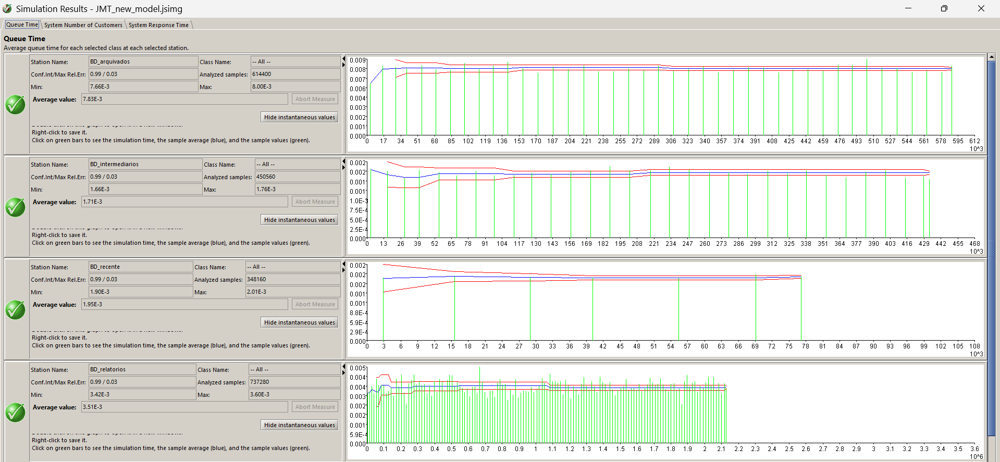
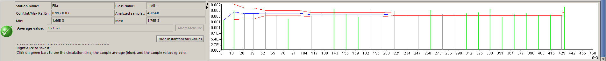

Tempo de resposta do sistema:
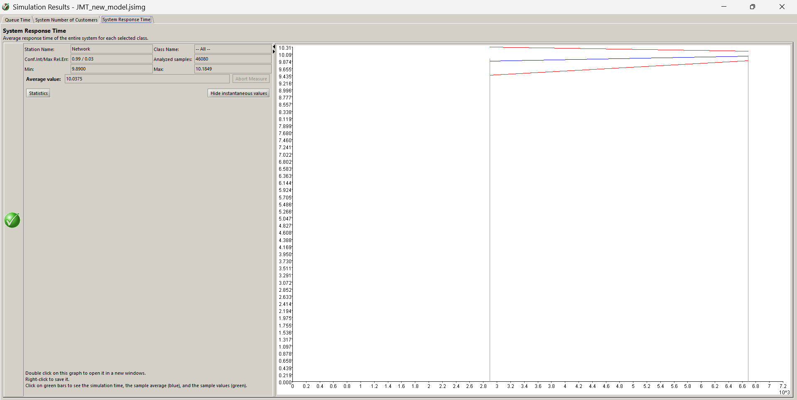

Tempo de resposta de cada fila:

BD_recente
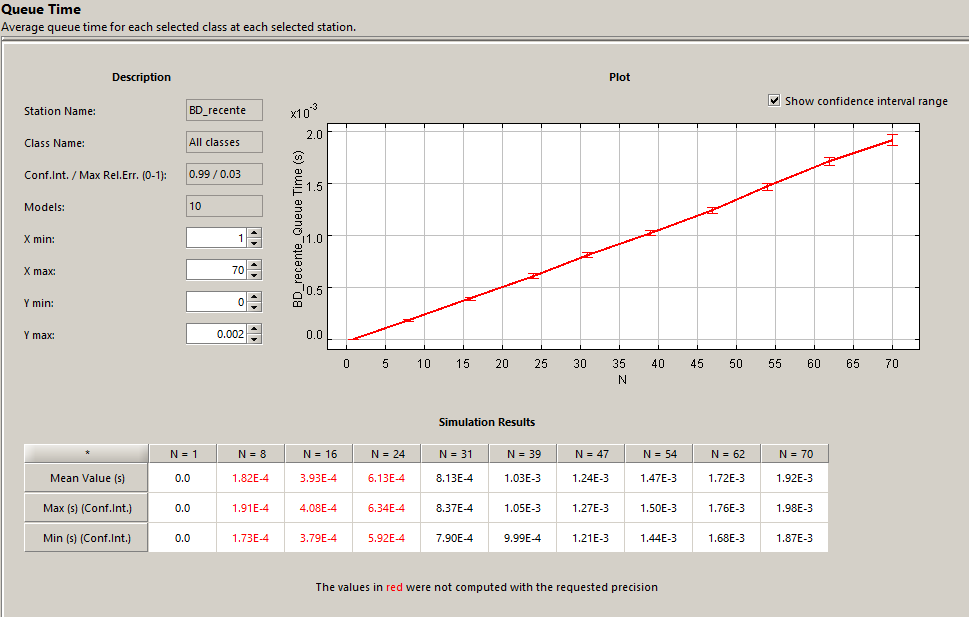

BD_intermediario
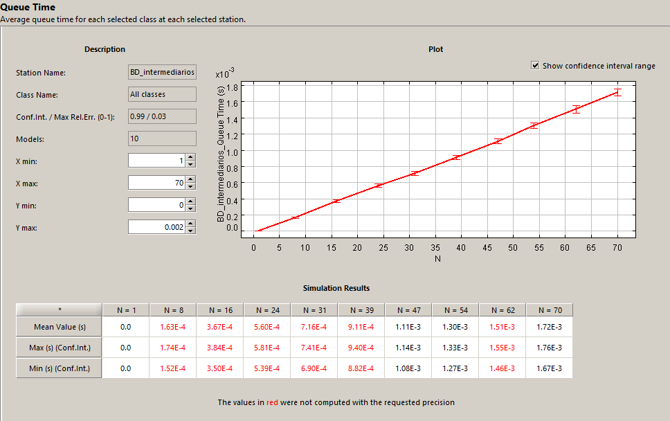

BD_arquivados
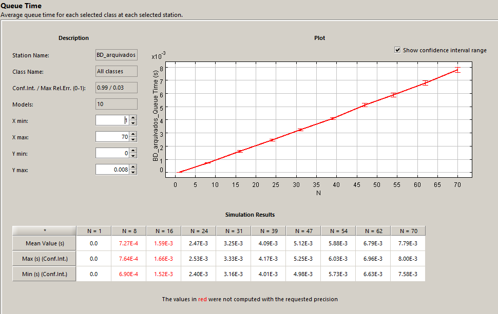

BD_relatorios
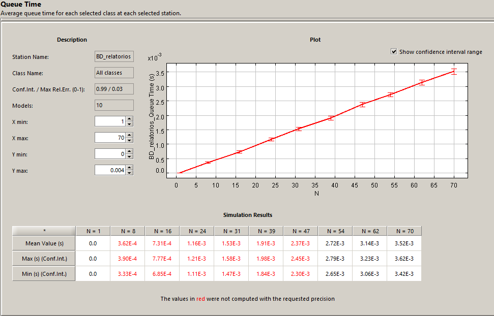


## Simulação dos Cenários de Pico
Após a revisão e atualização do modelo, será realizada a simulação dos cenários de pico, levando em conta as melhorias implementadas. Os principais passos incluem:

Preparação dos Cenários de Uso:

Objetivo:
- Avaliar o comportamento do sistema em condições de Pico

Métodos: 
- 150 requisições simultâneas

Resultados Esperados: 
- Responder todas as requisições com tempo médio < 2 segundos.

### Configuração da simulação:

**Sistema ECM Novo:** 20 requisições por segundo

**Usuários:** Probabilidade de realizar requisições sendo:
- 65% para o banco de dados com arquivos recentes;
- 15% para o banco de dados com arquivos não tão recentes;
- 15% para o banco de dados com arquivos de pouco uso através do sistema de fila para procesa-los.

**Banco de dados recente:** Processa 50 requisições por segundo

**Banco de dados intermediario:** Processa 25 requisições por segundo

**Fila de acesso ao banco de dados arquivados:** Processa 25 requisições por segundo

**Banco de dados de relatorios:** Processa 10 requisições por segundo

Com esta configuração, obtemos os seguintes resultados na nova simulação visando cenarios normais onde o sistema consta 150 usuários fazendo uso da plataforma ECM.

Processamento nas filas:
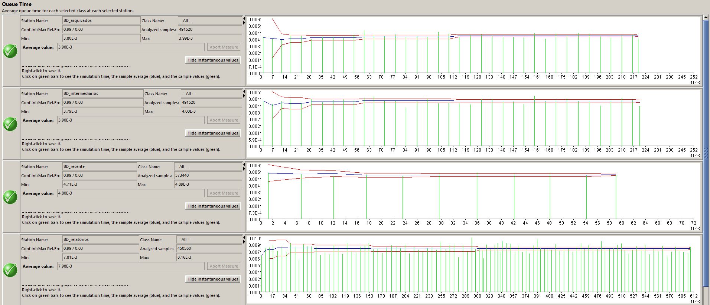
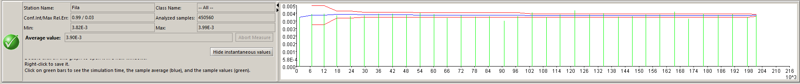

Tempo de resposta do sistema:
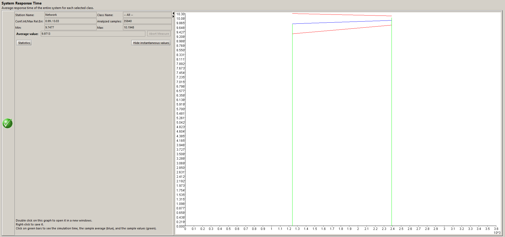

Tempo de resposta de cada fila:

BD_recente
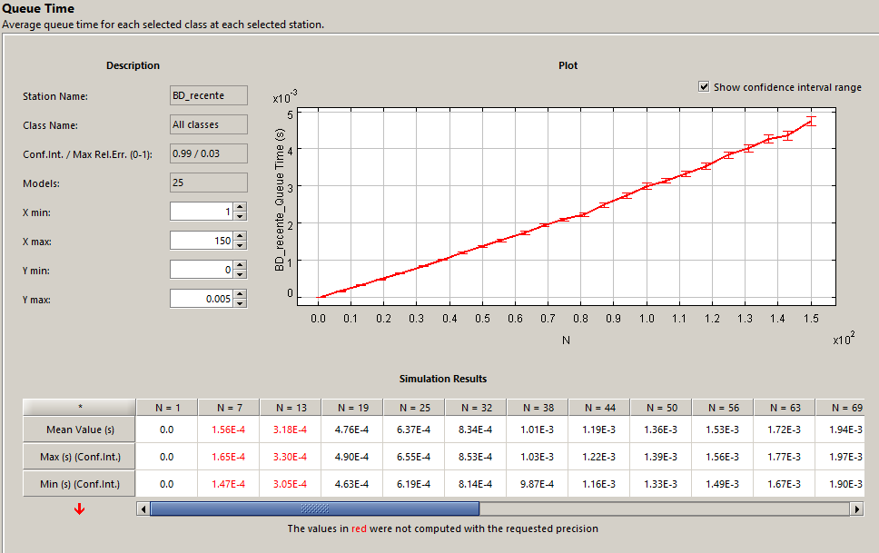

BD_intermediario
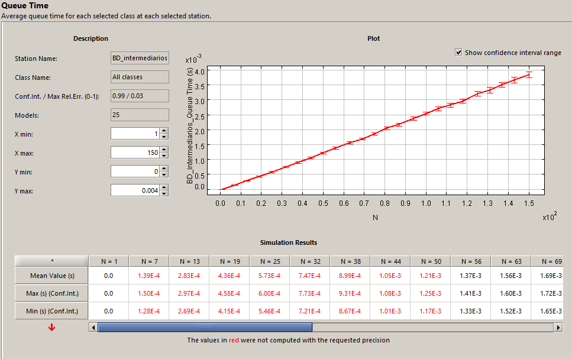

BD_arquivados
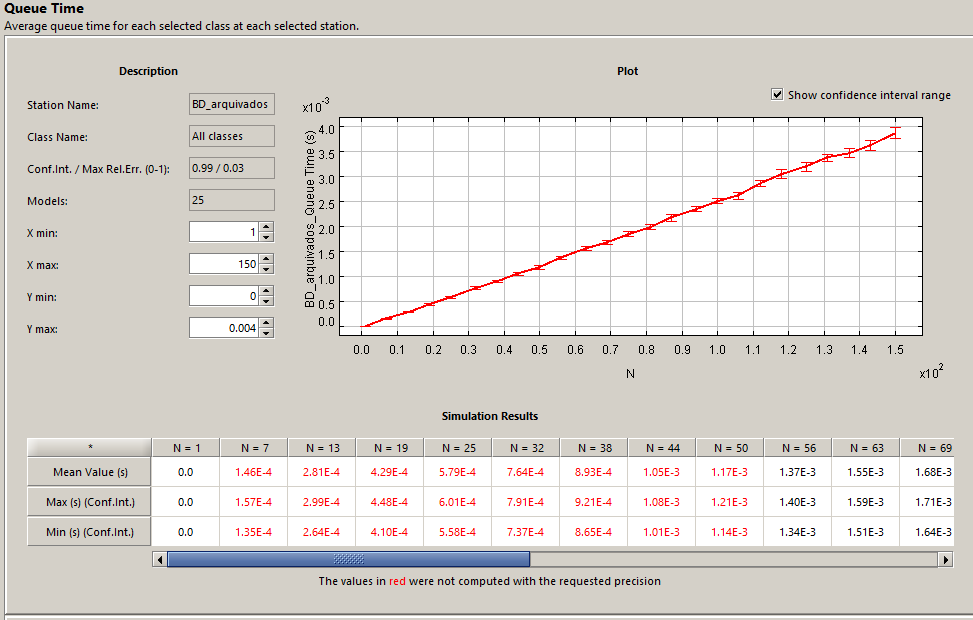

BD_relatorios
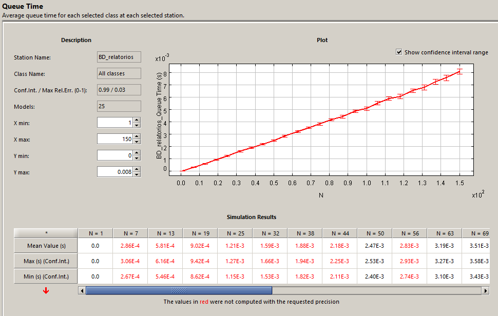


## Simulação dos Cenários de Pico
Após a revisão e atualização do modelo, será realizada a simulação dos cenários de pico, levando em conta as melhorias implementadas. Os principais passos incluem:

Preparação dos Cenários de Uso:

Objetivo:
- Avaliar o comportamento do sistema em condições de Pico

Métodos: 
- 300 requisições simultâneas

Resultados Esperados: 
- Responder todas as requisições com tempo médio < 2 segundos.

### Configuração da simulação:

**Sistema ECM Novo:** 20 requisições por segundo

**Usuários:** Probabilidade de realizar requisições sendo:
- 65% para o banco de dados com arquivos recentes;
- 15% para o banco de dados com arquivos não tão recentes;
- 15% para o banco de dados com arquivos de pouco uso através do sistema de fila para procesa-los.

**Banco de dados recente:** Processa 50 requisições por segundo

**Banco de dados intermediario:** Processa 25 requisições por segundo

**Fila de acesso ao banco de dados arquivados:** Processa 25 requisições por segundo

**Banco de dados de relatorios:** Processa 10 requisições por segundo

Com esta configuração, obtemos os seguintes resultados na nova simulação visando cenarios normais onde o sistema consta 300 usuários fazendo uso da plataforma ECM.

Processamento nas filas:
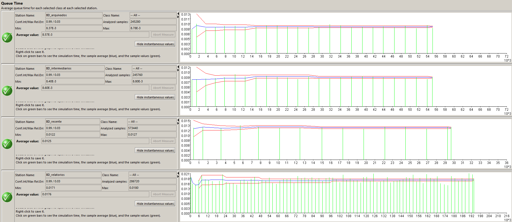
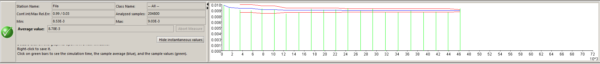

Tempo de resposta do sistema:
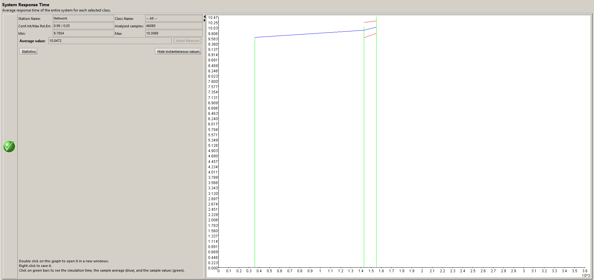

Tempo de resposta de cada fila:

BD_recente
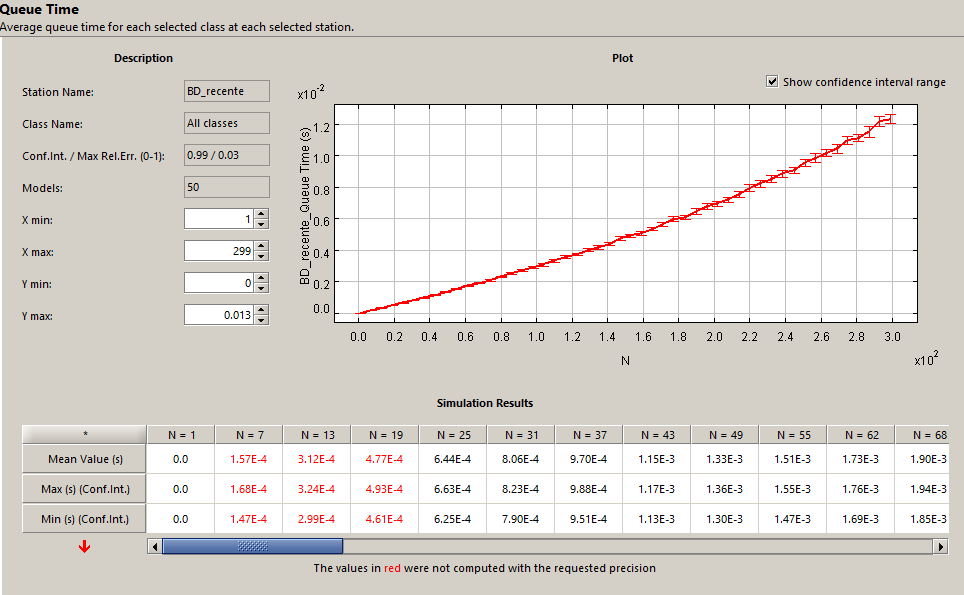

BD_intermediario
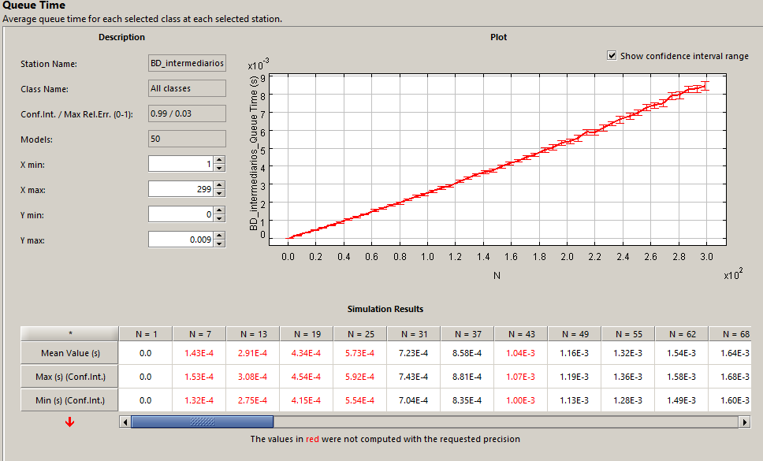

BD_arquivados
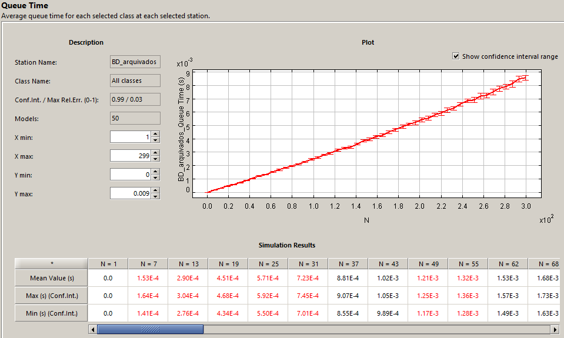

BD_relatorios
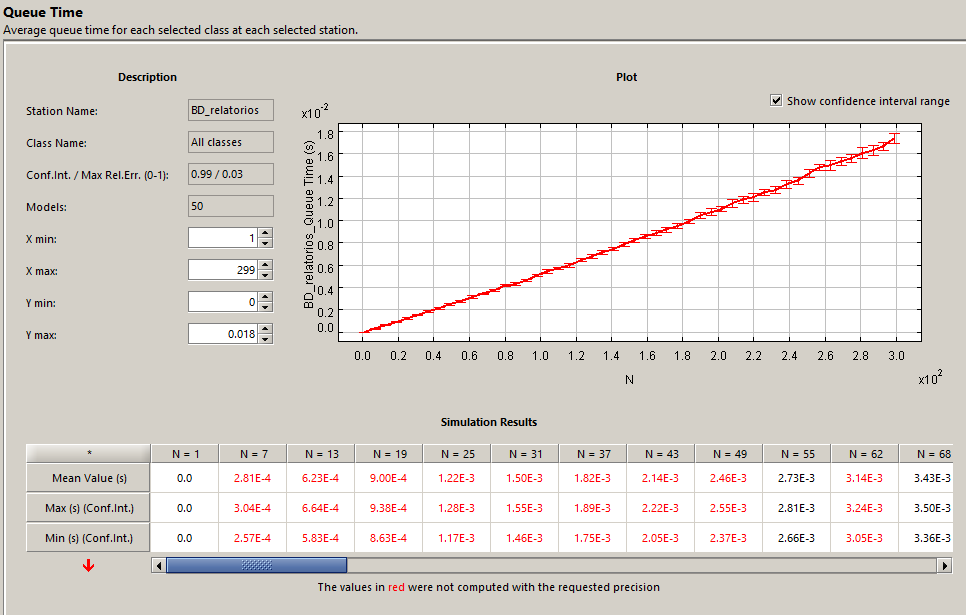

# Sprint 4

##  4.1.a) Identificação de ajustes a serem implementadas, com base nos resultados obtidos dos testes não funcionais [2,0 pontos]

De acordo com o aprofundamento do projeto, novos componentes foram escolhidos como candidatos a melhoria dos requisitos não funcionais do projeto. Desse modo, os seguintes componentes possuem a função de multiplicadores de melhoria dos requisitos:

- **Segregação de Ambientes Computacionais**: Para definir prioridades de acessos de recursos computacionais e tornar possível o uso de técnicas como escalonamento, é necessário segregar as diferentes tecnologias do sistema em máquinas virtuais isoladas, de modo a impedir a competição de recursos computacionais entre dois componentes.
- **Métricas Computacionais de Banco de Dados**: Através da geração de métricas a partir de logs programados, o componente de controle arquitetural do sistema deve poder consultar o uso de recursos computacionais dos nós de banco de dados. Para isso, tecnologias como Prometheus e demais ferramentas que ofereçam controle sobre arquivos de texto produzidos por logs de sistema podem ser utilizadas. 
- **Escala Vertical nos Bancos de Dados por Componente de Controle**: A solução proposta divide o banco de dados em três. Ainda sim, de acordo com a volumetria de acesso aos recursos dos bancos de dados, pode ser necessário o uso de escala para diminuir o tempo de resposta em condições de pico. A escala vertical nos nós de banco de dados enquadram recursos computacionais como CPU e RAM, além de utilizar medidas similares como gatilho para escala em um componente de controle malha-fechada.

Com a identificação das três abordagens listadas acima, o sistema deve performar ainda melhor comparado aos testes anteriores. Ainda sim, recomenda-se o uso de outras técnicas para implementação futura, capazes de melhorar ainda mais a performance do sistema:

- **Uso de Processamento Assíncrono para Acesso de Dados Antigos**: Como o banco de dados antigos tende a ter crescimento exponencial e em algum momento suas pesquisas demorem mais, recomenda-se além de outras técnicas, a criação de uma abordagem assíncrona para acesso de seus dados. Como sugestão, uma feature de “relatórios” pode ser desenvolvida onde o acesso ao banco de dados antigos é feito através de uma fila FIFO de forma assíncrona e seu resultado salvo em um banco de dados específico para relatórios, onde as informações consultadas serão armazenadas por um período específico de tempo. Dessa forma, dados antigos que precisarem ser acessados várias vezes em um período específico de tempo poderão ser consultados de forma eficiente.
- **Uso de Cache para salvar índices de resultados de pesquisa**: Como realizar pesquisas complexas em banco de dados pode ser uma tarefa custosa e existem precauções relacionadas a salvar informações sensíveis em cache, o resultado de pesquisas complexas realizadas diversas vezes pode ser otimizado através da armazenagem dos índices (chaves ou atributos primários) resultantes em um banco de dados de memória chave-valor. Dessa forma, os bancos de dados de metadados podem ser liberados de realizar diversas vezes consultas complexas em um curto período de tempo.

Dessa forma, ao implementar as cinco técnicas listadas, presume-se que os requisitos não funcionais de performance de acesso à informação pelo ECM sejam satisfeitos.

## 4.1.b) Códigos dos ajustes

Na figura abaixo (Figura X), é apresentada a segregação de nossos bancos de dados conforme descrito no item 4.1.a. Em seguida, você pode verificar a lógica utilizada para essa segregação em nosso sistema que simula o software ECM. Nesta simulação, nosso banco de dados com os arquivos mais recentes recebe 70% das requisições, o banco de dados com dados não tão recentes recebe 20% das requisições, e o banco de dados com os arquivos mais antigos ou menos visualizados recebe apenas 10% das requisições realizadas pelos funcionários do banco.

## 4.2 Evidencias de testes não funcionais para ajustes

Grande parte desse artefato foi entregue na sprint 3. O que teve de alteração foi a implementação do sistema antigo e seus testes. Além da implementação do body nos testes de rastreabilidade.

## 4.2.a) Implementação dos Testes Automatizados

Instruções para testes estão nos README.md do ECM e sistema antigo. Destaco abaixo a implementação do trecho de código onde extraimos o body das requisições.

Implementação do body nos logs.


## 4.2.b) Análise dos Registros de Testes Automatizados

Já escritos na sprint 3, porém a análise com dos registros do sistema antiogo vs Novo estão melhor detalhados no item '4.4.b) Evidência dos Tradeoffs com Base em Medidas Realizadas' não sendo necessário escrever novamente aqui para evitar redundância.


## 4.3 Medir o novo sistema

### 4.3 c) Testes Não Funcionais dos Componentes de Rastreabilidade

#### 1. Codificação dos Testes Automatizados

Os testes automatizados foram codificados utilizando uma combinação de ferramentas para captura e análise de logs, garantindo que todas as informações de acesso dos usuários sejam corretamente registradas. Os scripts foram desenvolvidos em Python e utilizam bibliotecas como Requests para simular acessos à plataforma.

##### Objetivos dos Testes:

- Capturar informações detalhadas sobre o acesso do usuário.
- Verificar a precisão dos logs registrados.
- Comparar as informações registradas com os padrões esperados para validação.

#### 2. Execução dos Testes

Os testes foram executados em um ambiente de simulação, onde uma variedade de cenários de acesso foram simulados para garantir a cobertura adequada dos casos de uso esperados.

##### Cenários de Teste e Resultados:

**Cenário 1: Acesso a partir de um único navegador em diferentes horários.**

- Resultado: Os logs registraram corretamente todas as informações de acesso (IP, navegador, data/hora, rota).

**Cenário 2: Acesso a partir de diferentes navegadores e dispositivos.**

- Resultado: Os logs registraram corretamente todas as informações de acesso (IP, navegador, data/hora, rota).

**Cenário 3: Navegação por múltiplas rotas na plataforma.**

- Resultado: Os logs registraram corretamente todas as informações de acesso (IP, navegador, data/hora, rota).

#### 3. Análise de Resultados

Os resultados dos testes confirmaram a precisão e integridade dos dados registrados nos logs. As informações capturadas estavam em conformidade com os padrões esperados, demonstrando a eficácia dos mecanismos de rastreabilidade implementados.

#### 4. Considerações Finais

Os testes de rastreabilidade foram bem-sucedidos, fornecendo uma validação sólida da implementação dos componentes de registro de logs. A precisão dos dados capturados é crucial para garantir a conformidade com os requisitos regulatórios e a capacidade de rastrear eventos e atividades na plataforma.

## 4.4.b) Evidência dos Tradeoffs com Base em Medidas Realizadas

### Apresentação de Evidências dos Tradeoffs

A evidência dos tradeoffs de arquitetura é essencial para compreender como as decisões arquiteturais afetam os resultados obtidos. Nesta seção, apresentamos os dados e informações coletadas durante as medições e simulações que demonstram os tradeoffs identificados.

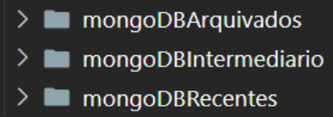

Figura x: Segregação de Ambientes Computacionais (banco de dados)

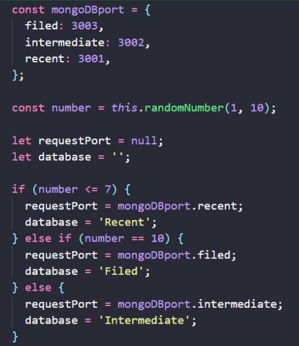

Figura x: Lógica implementada dentro do sistema ECM para simulação de requisições

Para aumentar ainda mais nosso controle sobre o desempenho do sistema, monitoramos não apenas o tempo de resposta, que é crucial para atender nosso requisito não funcional, mas também o uso de memória em cada requisição. A Figura X ilustra o body do retorno das nossas requisições.

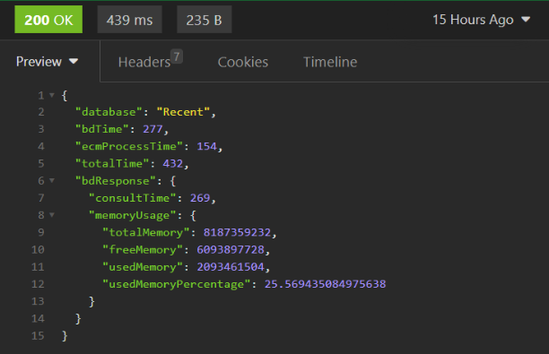

O objetivo de monitorar esses dados é permitir ajustes automáticos quando o uso de memória atingir 60% da capacidade. Nesses casos, aumentamos as configurações do sistema através do nosso sistema de malha fechada para garantir que o tempo de resposta continue atendendo o requisito não funcional de 2 segundos, sem impacto no atendimento das consultas simultâneas dos usuários do sistema ECM.

Por fim, estamos utilizando o Prometheus para tomar decisões informadas sobre a nossa arquitetura durante momentos de pico, controlando o sistema de forma eficaz. O objetivo principal é gerenciar a escalabilidade vertical dos nossos bancos de dados, assegurando que eles atendam à demanda durante períodos de alta carga de processamento.

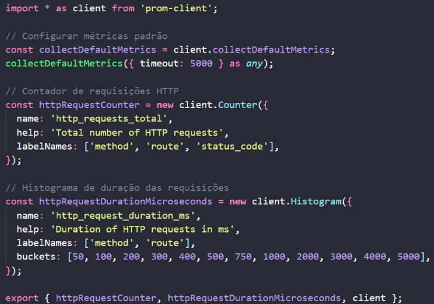

Aqui configuramos a coleta de métricas padrão do sistema e define duas métricas personalizadas para monitorar as requisições HTTP:
- Um contador (httpRequestCounter) para rastrear o número total de requisições, categorizadas por método, rota e código de status.
- Um histograma (httpRequestDurationMicroseconds) para medir a duração das requisições, categorizadas por método e rota, com intervalos predefinidos para análise detalhada da performance.

Com todas essas informações em mãos, programamos um alerta para ser acionado se a taxa de incremento (número de solicitações por segundo) for maior que 1000. Com isso, alteramos a nossa arquitetura realizando a escala vertical de nosso banco de dados.


#### Ferramenta de Teste Utilizada

- Utilizamos a ferramenta de teste K6 para realizar testes de carga e avaliar o comportamento do sistema. Abaixo estão os resultados obtidos:

#### Dados Coletados Durante as Medições

##### Sistema Antigo

###### 500 Requisições Simultâneas


| Critério                                 | Percentual | ✓ (Sucesso) | ✗ (Falha) |
|------------------------------------------|------------|-------------|-----------|
| Retorno do status 200                    | 89%        | 1925        | 232       |
| Requisições com menos de 3 segundos      | 10%        | 232         | 1925      |
| Requisições entre 3 a 5 segundos         | 0%         | 0           | 2157      |
| Requisições entre 5 a 10 segundos        | 0%         | 0           | 2157      |
| Requisições entre 10 a 15 segundos       | 0%         | 0           | 2157      |
| Requisições com mais de 15 segundos      | 89%        | 1925        | 232       |

###### 1000 Requisições Simultâneas


| Critério                                 | Percentual | ✓ (Sucesso) | ✗ (Falha) |
|------------------------------------------|------------|-------------|-----------|
| Retorno do status 200                    | 95%        | 3759        | 157       |
| Requisições com menos de 3 segundos      | 4%         | 157         | 3759      |
| Requisições entre 3 a 5 segundos         | 0%         | 0           | 3916      |
| Requisições entre 5 a 10 segundos        | 0%         | 0           | 3916      |
| Requisições entre 10 a 15 segundos       | 0%         | 0           | 3916      |
| Requisições com mais de 15 segundos      | 95%        | 3759        | 157       |

###### 1500 Requisições Simultâneas


| Critério                                 | Percentual | ✓ (Sucesso) | ✗ (Falha) |
|------------------------------------------|------------|-------------|-----------|
| Retorno do status 200                    | 66%        | 5299        | 2628      |
| Requisições com menos de 3 segundos      | 33%        | 2628        | 5299      |
| Requisições entre 3 a 5 segundos         | 0%         | 0           | 7927      |
| Requisições entre 5 a 10 segundos        | 0%         | 0           | 7927      |
| Requisições entre 10 a 15 segundos       | 0%         | 0           | 7927      |
| Requisições com mais de 15 segundos      | 66%        | 5299        | 2628      |

##### Sistema Novo

###### 500 Requisições Simultâneas


| Critério                                 | Percentual | ✓ (Sucesso) | ✗ (Falha) |
|------------------------------------------|------------|-------------|-----------|
| Retorno do status 200                    | 97%        | 11683       | 291       |
| Requisições com menos de 3 segundos      | 90%        | 10846       | 1128      |
| Requisições entre 3 a 5 segundos         | 0%         | 4           | 11970     |
| Requisições entre 5 a 10 segundos        | 8%         | 1067        | 10907     |
| Requisições entre 10 a 15 segundos       | 0%         | 57          | 11917     |
| Requisições com mais de 15 segundos      | 0%         | 0           | 11974     |

###### 1000 Requisições Simultâneas


| Critério                                 | Percentual | ✓ (Sucesso) | ✗ (Falha) |
|------------------------------------------|------------|-------------|-----------|
| Retorno do status 200                    | 97%        | 22566       | 681       |
| Requisições com menos de 3 segundos      | 89%        | 20897       | 2350      |
| Requisições entre 3 a 5 segundos         | 0%         | 71          | 23176     |
| Requisições entre 5 a 10 segundos        | 9%         | 2122        | 21125     |
| Requisições entre 10 a 15 segundos       | 0%         | 157         | 23090     |
| Requisições com mais de 15 segundos      | 0%         | 0           | 23247     |

###### 1500 Requisições Simultâneas


| Critério                                 | Percentual | ✓ (Sucesso) | ✗ (Falha) |
|------------------------------------------|------------|-------------|-----------|
| Retorno do status 200                    | 95%        | 32689       | 1514      |
| Requisições com menos de 3 segundos      | 88%        | 30426       | 3777      |
| Requisições entre 3 a 5 segundos         | 0%         | 228         | 33975     |
| Requisições entre 5 a 10 segundos        | 9%         | 3285        | 30918     |
| Requisições entre 10 a 15 segundos       | 0%         | 258         | 33945     |
| Requisições com mais de 15 segundos      | 0%         | 6           | 34197     |

### Discussão sobre Impactos no Sistema Antigo

#### 1. Análise dos Tradeoffs Identificados

- **Escalabilidade Vertical:**
  - Com a implementação das mudanças arquiteturais, observamos um aumento significativo na capacidade dos nossos bancos de dados em lidar com a demanda durante períodos de alta carga. A utilização do Prometheus nos permitiu monitorar e ajustar a escalabilidade vertical conforme necessário.

- **Desempenho de Requisições:**
  - No sistema novo, a maioria das requisições (90%) foi processada em menos de 3 segundos, indicando uma melhoria significativa em comparação com o sistema antigo, onde a porcentagem de requisições rápidas era consideravelmente menor.

Custos
- **Custo de Implementação:**
  - As mudanças arquiteturais, incluindo a integração de novas ferramentas como o Prometheus e a escalabilidade vertical dos bancos de dados, podem resultar em custos significativos de implementação e configuração.

- **Custo Operacional:**
  - Manter uma infraestrutura mais robusta e escalável pode aumentar os custos operacionais, incluindo despesas com servidores, licenças de software e monitoramento contínuo.

Complexidade
- **Complexidade de Manutenção:**
  - Com uma arquitetura mais complexa e escalável, a manutenção e o gerenciamento do sistema podem se tornar mais desafiadores. Isso pode exigir uma equipe de TI mais qualificada e recursos adicionais para garantir que o sistema funcione de maneira eficiente.

- **Tempo de Treinamento:**
  - A adoção de novas ferramentas e tecnologias requer treinamento da equipe para garantir que todos os membros estejam aptos a utilizar e manter o novo sistema. Isso pode resultar em custos adicionais e tempo gasto fora das operações normais.

#### 2. Impacto nos Resultados do Sistema Antigo

- **Retorno do status 200:**
  - No sistema antigo, a taxa de sucesso para o status 200 era menor, com mais falhas registradas durante os períodos de pico.

- **Tempo de Resposta:**
  - No sistema antigo, havia um número maior de requisições que levavam mais de 3 segundos para serem processadas, resultando em uma experiência de usuário menos eficiente.

- **Capacidade de Escalabilidade:**
  - O sistema antigo tinha limitações na escalabilidade vertical do banco de dados, o que frequentemente resultava em gargalos durante os picos de demanda.

- **Custos Adicionais:**
  - No sistema antigo, os custos de manutenção eram menores, mas a capacidade de lidar com picos de demanda era limitada. As melhorias no sistema novo vêm com um custo financeiro que precisa ser justificado pelos benefícios operacionais.

- **Complexidade Reduzida:**
  - O sistema antigo, embora menos eficiente, era menos complexo e mais fácil de manter com uma equipe menor.

- **Limitações de Escalabilidade:**
  - O sistema antigo tinha limitações significativas na escalabilidade, resultando em gargalos durante os picos de demanda. No entanto, essas limitações também mantinham os custos operacionais baixos.

A análise dos dados coletados e a comparação com o sistema antigo demonstram claramente os benefícios das decisões arquiteturais tomadas. As melhorias implementadas resultaram em um desempenho melhorado e maior capacidade de lidar com cargas elevadas, garantindo assim uma experiência de usuário mais eficiente e estável atendendo os requisitos não funcionais propostos. Apesar das melhorias significativas no desempenho e na escalabilidade com o novo sistema, há um aumento considerável nos custos operacionais e na complexidade de manutenção. Esses fatores devem ser cuidadosamente considerados ao avaliar a viabilidade e o retorno sobre o investimento das mudanças arquiteturais.


## 5. Arquitetura do Sistema Novo (Storytelling de Dados)

Para uma análise abrangente e detalhada da solução, acesse a apresentação final do projeto no seguinte link: [Apresentação Final](https://www.canva.com/design/DAGIbImD7WI/EosUEexhtNsNv_G4vyip-g/edit?utm_content=DAGIbImD7WI&utm_campaign=designshare&utm_medium=link2&utm_source=sharebutton). Nesta apresentação, você encontrará um resumo consolidado de todo o projeto, incluindo uma visão geral das melhorias implementadas e os resultados obtidos. A apresentação proporciona uma narrativa clara e visual dos dados, facilitando a compreensão do impacto e da eficácia das mudanças realizadas no sistema.
